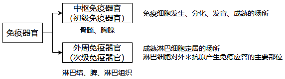
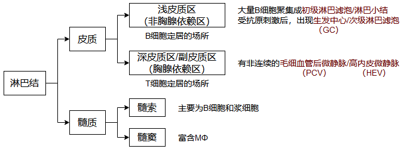
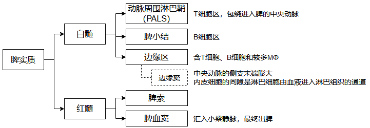
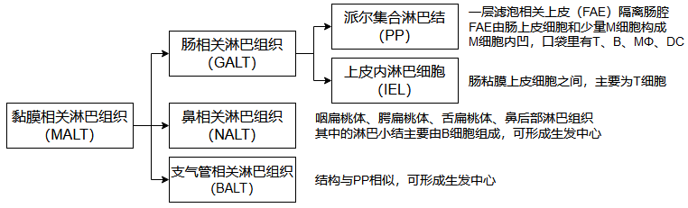
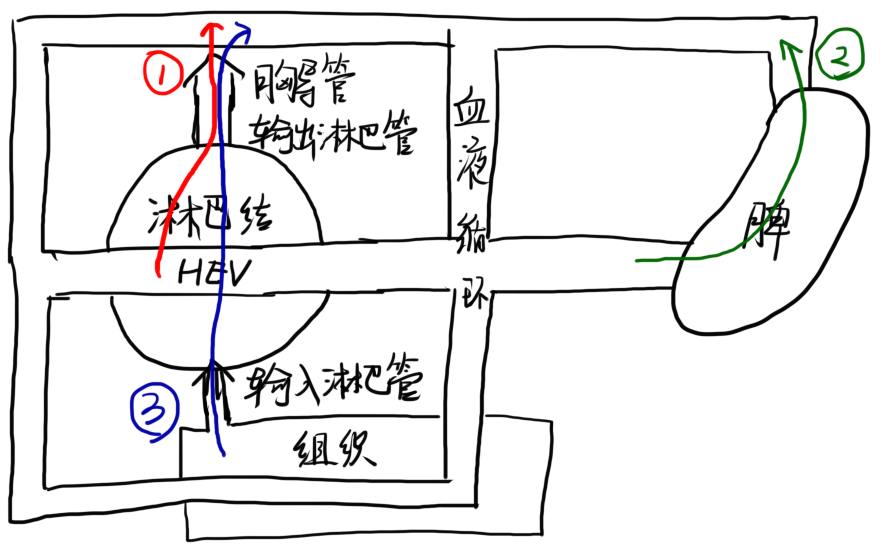

# 第2章 免疫器官和组织

## 第1节 中枢免疫器官

### 一、骨髓

骨髓是各类血细胞的发源地，B细胞发育成熟的场所。

#### 1. 骨髓的结构和细胞组成

> **造血诱导微环境**（HIM）：基质细胞＋分泌的造血因子＋细胞外基质
>
> **造血干细胞**（HSC）：具有高度自我更新能力和多能分化潜能的造血前体细胞
>
> **造血**：血细胞在骨髓中生长、分裂、分化的过程

#### 2. 骨髓的功能

* 各类血细胞和免疫细胞发生的场所
* B细胞和NK细胞分化成熟的场所
* 体液免疫应答发生的主要场所

### 二、胸腺

胸腺是T细胞分化、发育、成熟的场所。

#### 1. 胸腺的结构和细胞组成

##### 细胞组成

##### 胸腺结构

#### 2. 胸腺微环境

#### 3. 胸腺的功能

* T细胞分化、成熟的场所

* 免疫调节作用

  >  胸腺基质细胞产生的细胞因子和胸腺肽类分子对外周免疫器官和免疫细胞也有作用

* 自身免疫耐受的建立与维持

## 第2节 外周免疫器官和组织

### 一、淋巴结

#### 1. 淋巴结的结构

#### 2. 淋巴结的功能

* T细胞和B细胞定居的场所
* 免疫应答发生的场所
* 过滤作用：淋巴结是淋巴液的有效过滤器
* 参与淋巴细胞再循环

### 二、脾

#### 1. 脾的结构

#### 2. 脾的功能

* T细胞和B细胞定居的场所
* 免疫应答发生的场所
* 合成生物活性物质（如补体成分、细胞因子）
* 过滤作用：过滤血液

### 三、黏膜相关淋巴组织

黏膜相关淋巴组织（MALT）也称黏膜免疫系统（MIS），是发生黏膜免疫应答的主要部位

#### 1. MALT的组成

#### 2. MALT的功能

* 行使黏膜局部免疫应答
* 产生分泌性IgA

## 第三节 淋巴细胞归巢与再循环

#### 1. 定义

* **淋巴细胞归巢**：淋巴细胞选择性趋向迁移并定居于外周免疫器官特定区域或组织
  * 淋巴细胞表面的黏附分子（**归巢受体**）与特定组织HEV表面的黏附分子（**地址素**）结合，决定细胞去向
* **淋巴细胞再循环**：定居于外周免疫器官的淋巴细胞，进入血液循环，到达外周免疫器官，穿越HEV，重新分布于全身的反复循环过程
  1. 经HEV离开血液进入淋巴结→通过输出淋巴管、胸导管返回血循环
  2. 经脾动脉进入脾脏→经脾静脉返回血循环
  3. 组织中的淋巴细胞→经引流淋巴管进入淋巴结→通过胸导管返回血循环

#### 2. 生物学意义

* 使淋巴细胞分布合理
* 增加淋巴细胞与抗原和APC接触的机会
* 使所有免疫器官和组织联系成一个整体，传递信息