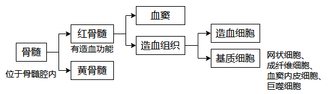
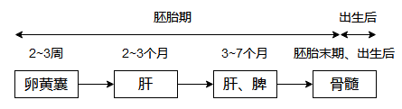
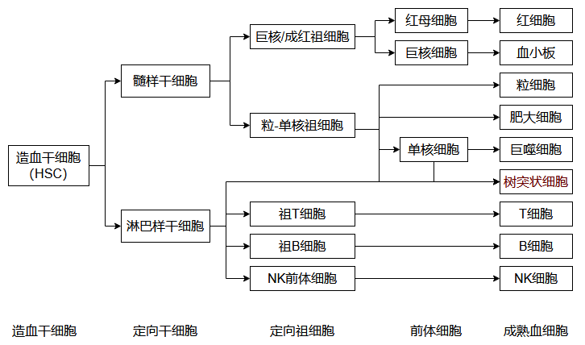
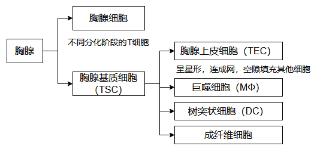
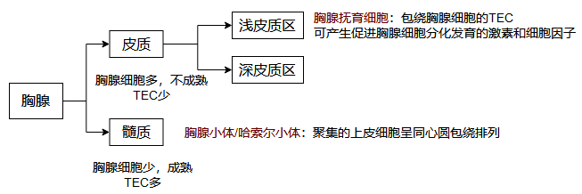

# 第2章 免疫器官和组织

## 第1节 中枢免疫器官

### 一、骨髓

骨髓是各类血细胞的发源地，B细胞发育成熟的场所。

#### 1. 骨髓的结构和细胞组成

> **造血诱导微环境**（HIM）：基质细胞＋分泌的造血因子＋细胞外基质
>
> **造血干细胞**（HSC）：具有高度自我更新能力和多能分化潜能的造血前体细胞
>
> **造血**：血细胞在骨髓中生长、分裂、分化的过程

#### 2. 骨髓的功能

* 各类血细胞和免疫细胞发生的场所
* B细胞和NK细胞分化成熟的场所
* 体液免疫应答发生的主要场所

### 二、胸腺

胸腺是T细胞分化、发育、成熟的场所。

#### 1. 胸腺的结构和细胞组成

##### 细胞组成

##### 胸腺结构

#### 2. 胸腺微环境

#### 3. 胸腺的功能

* T细胞分化、成熟的场所

* 免疫调节作用

  >  胸腺基质细胞产生的细胞因子和胸腺肽类分子对外周免疫器官和免疫细胞也有作用

* 自身免疫耐受的建立与维持