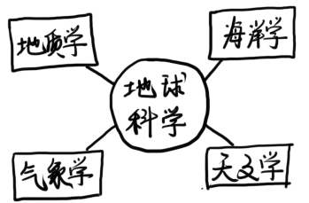
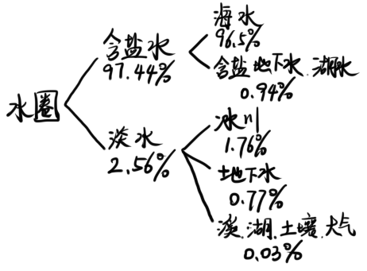
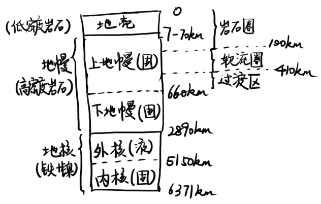

# 第0章 地球科学导论

## 0.1 什么是地球科学

地球科学是试图了解地球及其周围空间的所有学科的总称。

* 地质学
  * 自然地质学：考察地球的物质组成，研究塑造地球景观的内部与外部过程
  * 历史地质学：了解地球的起源和演化
* 海洋学：研究海水成分与运动、海岸变化、海底地形、海洋生物
* 气象学：研究天气和气候变化的大气圈及其作用
* 天文学：研究宇宙空间的科学

## 0.2 地球的圈层

* 水圈

  

  > 海洋覆盖71%的地球表面，占据超过96%的水
  >
  > 地下淡水占所有淡水的30%，和所有液态淡水的96%

* 大气圈

  > 与固体地球的半径相比，大气圈是一个很薄的圈层

* 生物圈

  > 生物圈局限在一个非常接近于地表的狭窄地带中

* 岩石圈

  

土壤是4个圈层的共有部分

* 固体部分由风化的岩石碎屑（岩石圈）、腐烂动植物生成的有机物（生物圈）组成
* 分解和破碎的岩石碎片是风化过程的产物，需要空气（大气）和水（水圈）的共同作用

## 0.3 地球系统

### 0.3.1 系统

**系统**是由相互作用或相互依赖的各个部分组成的复杂整体

### 0.3.2 各个系统的相互关联

#### 地球系统的能量

* 太阳：驱动大气圈、水圈和地表发生的外部过程
* 地球内部的能量：驱动产生火山、地震和山脉的内部过程

#### 人类和地球系统

人类是地球系统的一部分，人的行为会影响到其他所有部分

## 0.4 地球科学中的时间与空间尺度

* 时间尺度：小到原子内部，大到无穷大宇宙

* 空间尺度：小到几十分之一秒，达到几十亿年

  > 地球形成与46亿年前

## 0.5 资源和环境问题

**环境**是指围绕和影响生物体的一切事物，无生命的部分统称为**自然环境**。

### 0.5.1 资源

* 可再生资源：可以在相对较短的时间得到补充

* 不可再生资源：形成过程太过漫长，地球上的资源量可认为是固定的

  > 一些不可再生资源能回收后重复使用

### 0.5.2 环境问题

* 人为引起和加剧的问题

* 自然灾害

  > 自然灾害是自然现象，只有这些现象发生在人类的定居点时，才会构成危害。
  >
  > 自然灾害的威胁常常是随着人口的增加而增大的。