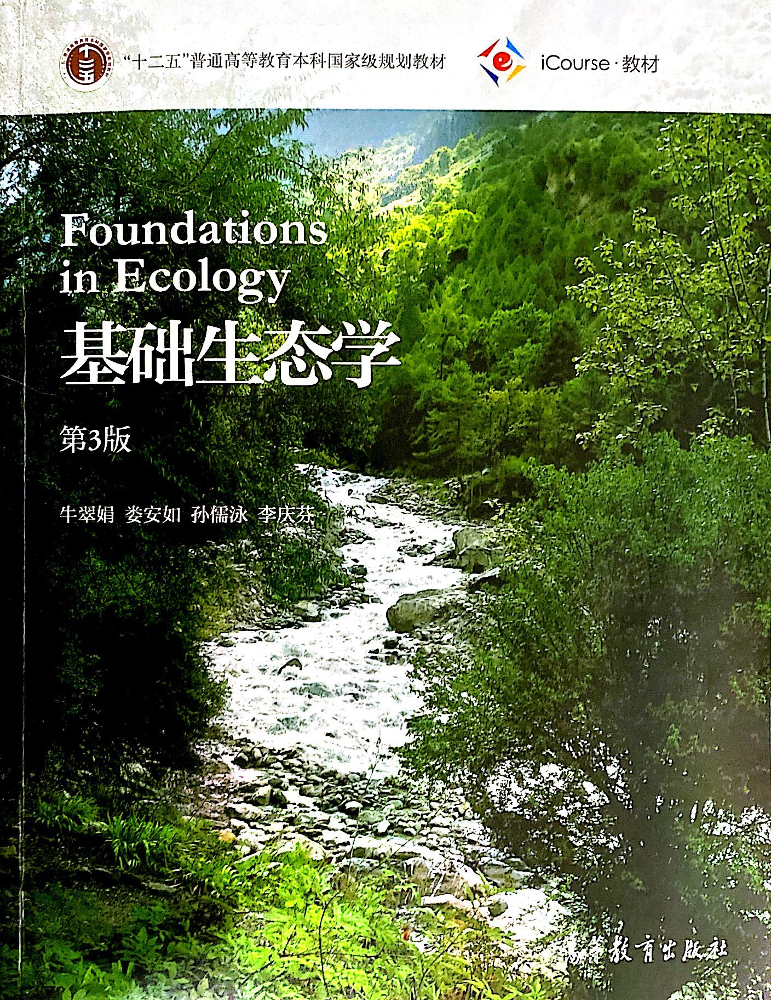

# 基础生态学

* [第0章 绪论](ch00.md)

## 第一部分 个体生态学

* [第1章 生物与环境](ch01.md)
* [第2章 能量环境](ch02.md)
* [第3章 物质环境](ch03.md)

## 第二部分 种群生态学

* [第4章 种群及其基本特征](ch04.md)
* [第5章 生物种及其变异与进化](ch05.md)
* [第6章 生活史对策](ch06.md)
* [第7章 种内和种间关系](ch07.md)

## 第三部分 群落生态学

* [第8章 群落的组成与结构](ch08.md)
* [第9章 群落的动态](ch09.md)
* [第10章 群落的分类和排序](ch10.md)

## 第四部分 生态系统生态学

* 第11章 生态系统的一般特征
* 第12章 生态系统中的能量流动
* 第13章 生态系统的物质循环
* 第14章 地球上生态系统的主要类型及其分布

## 第五部分 应用生态学

* 第15章 应用生态学

## 第六部分 现代生态学的发展

* 第16章 分子生态学
* 第17章 景观生态学

