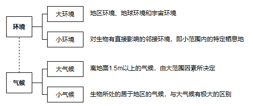

# 第1章 生物与环境

## 1.1 生态因子

### 1.1.1 环境

**环境**是指某一生物体/群体周围一切的综合，包括空间以及直接或间接影响该生物体/群体生存的各种因素。

---

环境是一个相对的概念，必须有一个特定的主体或中心，环境依主体而定。生态学研究更重视**小环境**。

* 大环境：地区环境、地球环境和宇宙环境
  * 大气候：离地面1.5m以上的气候，由大范围因素所决定
* 小环境：对生物有直接影响的邻接环境，即小范围内的特定栖息地
  * 小气候：生物所处的居于地区的气候，与大气候有极大的区别

---

 **环境系统**概念强调把人类环境作为一个统一的整体看待，避免人为地将环境分隔为互不相关的各个部分。

### 1.1.2 生态因子

**生态因子**是指环境要素中对生物起作用的因子，所有生态因子构成生物的**生态环境**，特定生物体或群体的栖息地的生态环境称为**生境**。

#### (1) 生态因子的分类

* 按性质分类：气候因子、土壤因子、地形因子、生物因子、人为因子
* 按有无生命特征分类：生物因子、非生物因子
* 按对动物种群数量变动的作用
  * **密度制约因子**：对动物种群的影响强度随种群密度而变化，例如：食物、天敌等生物因子
  * **非密度制约因子**：对动物种群的影响强度不随种群密度而变化，例如：温度、降水等气候因子
* 按稳定性及作用特点
  * **稳定因子**：例如地心引力、地磁、 太阳常数，决定生物的分布
  * **周期性变动因子**：例如四季变化、潮汐涨落，影响生物的分布
  * **非周期性变动因子**：例如风、降雨、捕食，影响生物的数量

#### (2) 生态因子的作用特征

* **综合作用**：每个生态因子总是与其他因子相互联系、相互影响、相互制约的
* **主导因子作用**：众多因子并非等价的，其中一个其决定性作用
* **阶段性作用**：在不同发育阶段，生物需要的生态因子及强度不同不可替代性和补偿作用
* **不可替代性**：生态因子虽然非等价，但都必要，不能缺少
* **补偿作用**：一定条件下，一个因子数量不足，可依靠相近因子的加强得以补偿
* 直接作用和间接作用
  * 直接作用：生态因子对生物的作用可以是直接的
  * 间接作用：通过影响直接因子从而间接影响生物

## 1.2 生物与环境的相互作用

### 1.2.1 环境对生物的作用

环境的非生物因子对生物的影响，一般称为**作用**。

生物不是被动地对待环境的作用，而是进行调整，以适应环境中的生态因子变化，减小限制作用。

* 生物会在不同环境中产生不同的适应性变异
* 生物能积极利用某些生态因子的周期性变化
  * 例如：光照周期对**生物钟**起到扳机作用

### 1.2.2 生物对环境的反作用

生物对环境的影响，一般称为**反作用**，表现在改变了生态因子的状况。

生物和生物之间的相互关系，可称为**相互作用**。

## 1.3 最小因子、限制因子与耐受限度

### 1.3.1 李比希最小因子定律

通过研究因子对植物生长的影响而总结出来

**李比希最小因子定律**：低于某种生物需要的最小量的任何特定因子，是决定该种生物生存和分布的根本因素。

> 李比希定律只有在严格稳定状态下才能应用，且还要注意生态因子间的补偿作用。

### 1.3.2 限制因子

对最小因子定律的发展：不仅因子不足时会成为生物的限制因子，因子过量时同样会成为限制因子

**限制因子定律**：

1. 生态因子低于最低状态时，生命现象全部停止
2. 在最适状态下，显示了生理现象的最大观测值
3. 在最大状态之上，生理现象又停止

**限制因子**：接近或超过某种生物的耐受性极限而阻值其生存、生长、繁殖扩散的生态因子。

### 1.3.3 耐受限度与生态幅

#### (1) 耐受性定律

**耐受性定律**：任何一个生态因子在数量或质量上的不足或过多，即当其接近或达到某种生物的耐受限度时，会使该种生物衰退或不能生存。

耐受性定律的发展

* 不同因子：每种生物对不同生态因子的耐受范围存在差异
* 不同阶段：生物在整个个体发育过程中，对环境因子的耐受限度是不同的
* 不同物种：不同的生物种对同一生态因子的耐受性是不同的
* 相互作用：生物对某一生态因子处于非最适度状态时，对其他生态因子的耐受限度也下降

#### (2) 生态幅

生物对生态因子的耐受范围称为**生态幅**。

* 生态幅往往受到适应范围较狭窄的生态因子的限制
* 生物不同发育期对生态因子的耐受限度不同，物种的生态幅往往取决于它临界期的耐受限度，通常是繁殖期
* 生物的分布区是由它的生态幅及其环境相互作用决定的

#### (3) 耐受限度的调整

生物对生态因子的耐受性不是固定不变的，通过自然驯化或人为驯化可改变生物的耐受范围。

>  驯化过程是通过生物的生理调节实现的，即通过酶系统的调整，改变生物的代谢速率和耐受限度。

生物通过控制内环境稳态，减少对环境的依赖，扩大生物对生态因子的耐受范围，提高对环境的适应能力。

> 内稳态是通过生理过程或行为调整而实现的
>
> 内稳态只是扩大了生态幅，不能完全摆脱环境的限制