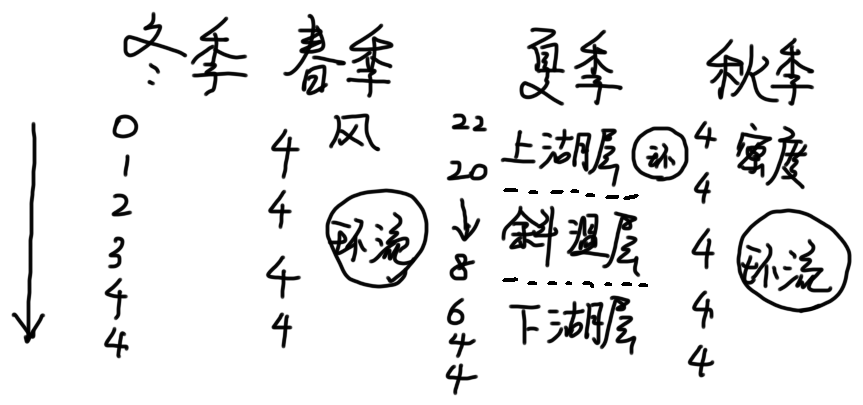
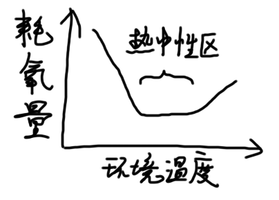

# 第2章 能量环境

**光**和**温度**组成了地球上的能量环境，**风**与**火**是具有能量的生态因子。

## 2.1 光的生态作用及生物对光的适应

### 2.1.1 地球上光的分布

#### (1) 太阳辐射的组成

太阳辐射光谱主要由短波（**紫外线**）、**可见光**和**红外线**组成。

#### (2) 影响太阳光分布的因素

* 大气中各种成分的吸收、反射、散射
* 太阳高度角（日变化）
* 地轴倾角与地球公转（年变化）
* 海拔、朝向、坡度

### 2.1.2 光质的生态作用及生物的适应

#### (1) 光质的分布规律

* 纬度：纬度越高，长波越多，短波越少
* 海拔：海拔越高，短波越多，长波越少
* 年变化：夏季短波多，冬季长波多
* 日变化：中午短波多，早晚长波多

#### (2) 光质对植物的影响

##### 1. 光质影响光合作用速率，不同色素的高吸收波段不同

> 光合作用能利用的光谱带称为**光合有效辐射**。
>
> * 多数植物只能利用380~710nm波长的辐射能。
> * 细菌叶绿素的吸收峰值在800~890nm.

##### 2. 光质影响水中藻类的分布

水中植物色素种类的差异反映了对光质的适应

> * 陆生植物和水表层的绿藻：叶绿素、类胡萝卜素
> * 深海的红藻：藻红蛋白、藻蓝蛋白
> * 褐藻、硅藻：叶黄素

##### 3. 光质影响光合作用的产物

红光利于糖的合成，蓝紫光利于蛋白质的合成

##### 4. 光质影响植物的形态建成、向光性和色素形成

> * 短波光使植物向光性更敏感
> * 青蓝紫光和紫外线抑制茎生长
> * 高山植物茎叶含花青素、叶干粗短、叶面缩小、绒毛发达

#### (3) 光质对动物的影响

##### 1. 可见光

* 人类和许多脊椎动物只能看见可见光
* 太阳鱼的视力峰值在500~530nm，对应透明水层中的光波长
* 昆虫可见光偏短波，可用黑光灯诱捕

##### 2. 不可见光

* 紫外线：杀菌作用、促进维生素D合成
* 红外线：地表热量的基本来源

### 2.1.3 光照强度的生态作用及生物的适应

#### (1) 光照强度的变化

* 纬度：纬度越高，强度越弱
* 海拔：海拔越高，强度越强
* 日变化：中午最强，早晚最弱
* 年变化：夏季最强，冬季最弱
* 地形：南坡>平地>北坡

#### (2) 对生物的影响

* 动物：影响生长发育、影响体色

  > 中华鳖在黑暗中生长较快。

* 植物：影响叶绿素形成、促进增长分化、利于果实成熟和品质提高

  > 植物在黑暗中不能合成叶绿素，称为**黄化现象**。

#### (3) 植物对光照强弱的适应

* 植物叶子的日运动

* 光合作用途径：C3/C4/CAM植物

  > C4植物分布在热带、亚热带，能利用低浓度CO2

* 阴地植物/阳地植物

  > * 阳地植物的光补偿点、光饱和点高
  > * 阳地植物的叶子多层冠状排列，阴地植物叶子单层水平排列

#### (4) 动物对光照强弱的适应

##### 1. 视觉器官

* 夜行性动物眼睛大或突出
* 终生不见光的动物眼睛退化
* 深水鱼视觉器官发达，或者能发光

##### 2.活动行为

* 昼行性动物/夜行性动物
* 每天开始活动时间由光照强度决定

### 2.1.4 生物对光照周期的适应

#### (1) 日照长度的分布

日照长度的变化称为光周期。

* 年变化：夏至最长，东至最短
* 纬度：纬度越高，昼夜差距越大

#### (2) 生物的昼夜节律

光周期是地球上最具有稳定性和规律性的变化，所以生物最终选择了光周期作为生物节律的信号。

生物的昼夜节律受外源性周期和内源性周期影响，光周期使二者的变化同步起来。

#### (3) 植物的光周期现象

根据开花对日照的反应

* 长日照植物：黑暗小于某一数值才能开花，分布在温带、寒温带
* 短日照植物：黑暗超过某一数值才能开花，早春或深秋开花，分布在热带、亚热带
* 中日照植物：昼夜接近相等时开花，仅少数热带植物
* 日中性植物：开花不受日照长度影响

#### (4) 动物的光周期现象

* 繁殖
  * 长日照动物：春季交配，孕期较短，春夏产子
  * 短日照动物：秋季交配，孕期较长，春夏产子
* 昆虫滞育：生活史中有休眠相，为耐受秋冬严寒做准备
* 换毛换羽：大部分兽春秋两季换毛，鸟类一般每年换毛一次
* 动物迁徙：夏候鸟/冬候鸟、鱼类迁移

## 2.2 温度的生态作用及生物对温度的适应

### 2.2.1 地球上的温度分布

#### (1) 地表大气温度

##### 1. 空间分布

* 纬度：纬度越高，温度越低
* 海陆：陆地比海水变化大
* 地形：山脉阻挡暖冷气流，山谷盆地有逆温现象
* 海拔：海拔越高，气温越低

##### 2. 时间变化

* 日变化：日较差随纬度增加而减少，受地形影响
* 年变化：大陆性气候越明显、纬度越高，年较差越大

#### (2) 土壤温度

* 土壤表层温度变化剧烈，深度加深则变化幅度减小
* 深度增加，气温变化时间滞后
* 土壤上层变化周期短，下层周期长
* 年变化：中纬度地区受太阳控制，热带地区受雨量控制，高纬度高海拔地区受积雪影响

#### (3) 水体温度

### 2.2.2 温度与动物类型

* 根据动物与环境温度的关系：常温动物、变温动物
* 根据动物热能的主要来源：外温动物、内温动物

> 动物代谢率最低，耗氧量不随环境温度的变化而改变的环境温度称为**热中性区**。

### 2.2.3 温度对植物和外温动物的影响

#### (1) 酶反应速率

温度系数$Q_{10}$：温度每升高10度，代谢速率的变化

$Q_{10}=\dfrac{t°C的代谢率}{(t-10)°C的代谢率}$

$Q_{10}$一般是2，但随温度变化

#### (2) 生物发育与生长速率

只有温度高于一定值，才开始生长发育，称为**发育阈温度**或**生物学零度**。

生物的发育需要时间和温度的结合，即**有效积温法则**

$K=N(T-C)$

> K：总热量；N：发育所需时间；T：发育期环境平均温度；C：发育阈温度

可改写成$T=C+KV$

> V=1/N，表示发育速率

发育速率与环境温度成正比，或发育时间与环境温度成反比

#### (3) 驯化与气候驯化

一些植物发芽前需要经历寒冷期，称为**春化**。

一些动物经过低温锻炼，产热水平会提高，人工诱导称为**驯化**，自然产生称为**气候驯化**。

#### (4) 极端温度的影响

##### 1. 极端高温

##### 2. 极端低温

* 伤害
  * **冻害**：细胞内形成冰晶，细胞膜破裂
  * **冷害**：生理活动平衡破坏
* 典型的适应方式
  * **耐受冻结**：冰晶在细胞外形成，避免损伤细胞结构
  * **超冷现象**：积蓄溶质，降低凝固点，温度在0度以下而不结冰

### 2.2.4 内温生物对极端温度的适应

#### (1) 生物对低温的适应

##### 1. 植物

1. 形态：油脂类物质、植株矮小
2. 生理
   * 减少自由水、增加糖类、增加不饱和脂肪酸
   * 脱落酸增加，生长素、赤霉素减少
   * 抗冻蛋白抑制冰晶生长

##### 2. 动物

1. 形态
   * **贝格曼规律**：寒冷地区的内温动物个体更大，比表面积小
   * **阿伦规律**：寒冷地区内温动物的突出部分更小
   * 增加羽、毛密度，皮下脂肪厚度
2. 生理
   * 增加产热
     * 颤抖性产热（ST）：仅用于急性冷暴露
     * 非颤抖性产热（NST）：主要发生在褐色脂肪组织（BAT），线粒体特别丰富
   * 逆流热交换机制：动静脉的排布方式
   * 异温性
     * 局部异温性：肢体末端温度比核心温度低
     * 时间异温性
       * 适应性低体温、冬眠
       * 环境温度过低时，能自动从冬眠中醒来
   * 耐冷动物热能曲线的特点：热中性区宽，下临界点低，直线斜率小
3. 行为：迁徙、集群

#### (2) 生物对高温的适应

##### 1. 植物

1. 形态：密绒毛和鳞片、叶子排列与折叠、木栓层
2. 生理
   * 降低含水量、蒸腾作用
   * 表达热休克蛋白：参与新生肽的折叠

##### 2. 动物

1. 形态
   * 毛皮隔热、颜色浅
   * 热窗散热（毛稀疏、皮薄的部位）
2. 生理
   * 适当放松恒温性，体温有较大波动
   * 表达热休克蛋白
3. 行为：穴居、昼伏夜出、夏眠、夏季滞育

### 2.2.5 生物对周期性变温的适应

* 一些生物在昼夜变温环境中发育更好
* 大多数植物种子在昼夜变温中萌发率高
* 昼夜变温中，生长、开花结实品质高

### 2.2.6 物种分布与环境温度

* 低温限制：限制向高纬度、高海拔地区分布
* 高温限制：限制向低纬度、低海拔地区分布
* 温度也会影响其他环境因素
* 温度和降水是物种分布的两个最主要因子

## 2.3 风对生物的作用

### 2.3.1 风对生物生长形态的影响

* 强风降低植物的生长高度
  * 风减小大气湿度，破坏水分平衡
  * 抵抗风力，基部变粗，不利长高
* 强风使数形成畸形树冠
* 风影响鸟兽体毛特征：风加速水分蒸发和散热

### 2.3.2 风是传播运输工具

* 风能传播花粉和种子
* 影响能飞行动物类群的地理分布
* 风传播化学信息

### 2.3.3 风的破坏作用

* 强风折断树枝
* 谷物倒伏减产

### 2.3.4 防风林

* 防风林的林带类型：紧密林带、疏透林带、通风林带
* 风流被分为3部分，分散成小股气流，改变方向，相互抵消
  * 向上抬起，从林顶通过
  * 向下倾斜，从树干通过
  * 直接穿过林冠

* 防风林效应的影响因素
  * 防风林越高，防风范围越广
  * 风速增加，防风效应也增加
  * 主风向垂直，防风效果最好

## 2.4 火对生物的影响

### 2.4.1 火对生物的作用

#### (1) 有益作用

* 加速把有机物变成无机物
* 减少耐火树种的竞争
* 清除地面杂物，利于根生长

#### (2) 有害作用

* 破坏物种关系，造成种群数量下降和物种贫乏
* 改变土壤结构和化学成分，降低吸水保水能力
* 大量肥料丧失

### 2.4.2 防火管理

* 生物工程防火：利用耐火树种，营造防火林带
* 开展计划烧除