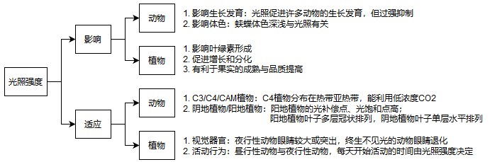

# 第2章 能量环境

**光**和**温度**组成了地球上的能量环境，**风**与**火**是具有能量的生态因子。

## 2.1 光的生态作用及生物对光的适应

### 2.1.1 地球上光的分布

#### (1) 太阳辐射的组成

太阳辐射光谱主要由短波（**紫外线**）、**可见光**和**红外线**组成。

#### (2) 太阳光的分布规律

>  综合考虑光照强度和日照时间，有时中纬度地区的总辐射量可以超过赤道地区。

### 2.1.2 光质的生态作用及生物的适应

> 光合作用能利用的光谱带称为**光合有效辐射**。

### 2.1.3 光照强度的生态作用及生物的适应

> 植物在黑暗中不能合成叶绿素，称为**黄化现象**。

### 2.1.4 生物对光照周期的适应

生物的昼夜节律受外源性周期和内源性周期影响，光周期使二者的变化同步起来。

光周期是地球上最具有稳定性和规律性的变化，所以生物最终选择了光周期作为生物节律的信号。

##### 

## 2.2 温度的生态作用及生物对温度的适应