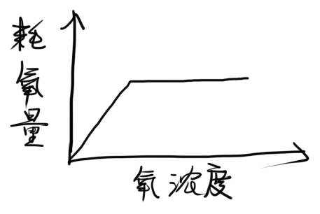
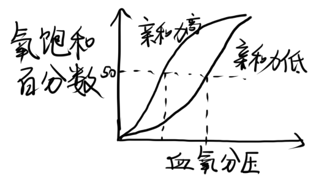

# 第3章 物质环境

## 3.1 生物对水的适应

### 3.1.1 水的作用与分布

#### (1) 水的生态作用

1. 所有有机体的内部介质
2. 有机体生命活动的基础
3. 作为外部介质，是水生生物获得资源和栖息的场所
4. 影响陆生生物的生长分布

#### (2) 陆地上的水分布

##### 1. 降雨量

* 随纬度变化很大，赤道附近降雨量多，向两极减少，副高比周围少
* 受海陆、地形、季节影响

##### 2. 大气湿度

* 受环境温度、地理位置影响

> * **相对湿度**：实际水汽含量÷饱和水汽
> * **饱和差**：饱和水汽－实际水汽含量

### 3.1.2 植物与水的关系

#### (1) 陆地植物的水平衡

1. 根系

   > 土壤孔隙抗重力所蓄积的水成为土壤的**田间持水量**。

   * 潮湿土壤：浅根系、缺乏根毛
   * 干燥土壤：深根系、根毛发达

2. 气孔：根据水分调节气孔开闭

3. 叶子：表面有角质层

#### (2) 陆生植物的分类

* **湿生植物**
  * 抗旱性弱，抗涝性强
  * 根系不发达，蒸腾弱
  * 根部与茎叶的通气组织相连
* **中生植物**
  * 根系与输导组织较发达，叶片表面有角质层
* **旱生植物**
  * 少浆液植物：体内含水量极少
    * 叶面积缩小或极度退化，气孔下陷
    * 根系发达，渗透压高
  * 多浆液植物：体内储存很多水分
    * 根茎叶称为肉质性器官，能储水
    * 大多失去叶片，白天气孔关闭

#### (3) 水生植物

* 发达的通气系统
* 细胞高浓度物质调节渗透压，盐腺、根排盐

#### (4) 水生植物的分类

* 沉水植物
  * 封闭式通气组织系统
  * 叶绿体大而多，适应水中弱光
* 浮水植物
  * 气孔分布在叶上面
  * 植物体内有大量通气组织，减轻重量
* 挺水植物：大部分挺出水面

### 3.1.3 动物对水的适应

#### (1) 水生动物

##### 1. 水生动物的渗透压调节

|      | 淡水硬骨鱼                     | 海洋硬骨鱼                         | 广盐性洄游鱼类     |
| ---- | ------------------------------ | ---------------------------------- | ------------------ |
| 特点 | 本身高渗，环境低渗             | 本身低渗，环境高渗                 |                    |
| 肾   | 肾小球发达，膀胱很小，大量排水 | 肾小球退化，极少排水               | 海水少尿，淡水多尿 |
| 鳃   | 鳃主动摄盐                     | 鳃主动排盐（二价离子通过尿液排出） | 海水排盐，淡水摄盐 |

* 海洋软骨鱼：与环境基本等渗
  * 大量尿素和氧化三甲胺维持自身高渗
  * 尿素抑制酶活性，氧化三甲胺抵抗副作用
* 其他生物
  * 无脊椎动物：渗透压顺应者
  * 海龟、海鸟：盐腺排盐
  * 哺乳动物：排高渗尿

##### 2. 对水密度的适应

* 失去四肢、身形可以很庞大
* 上层有鳔，深海无鳔

#### (2) 两栖动物

* 在水中：肾脏同淡水鱼，皮肤相当于鳃
* 在陆上：皮肤、膀胱可吸收水分

#### (3) 陆生动物

##### 1. 陆生动物的水平衡

* 增加得水
  * 昆虫从体表直接从潮湿大气吸水
  * 很多动物依赖代谢水
  * 骆驼大量饮水贮存
* 减少失水
  * 减少呼吸失水：逆流交换机制
  * 减少蒸发失水：角质层、鳞片、皮肤
  * 减少排泄失水：肾、泄殖腔的重吸收
  * 排泄含氮废物的形式：氨→尿素→尿酸
* 行为适应

##### 2. 陆生动物对湿度的适应

* 动物通过运动、迁徙选择喜好的湿度
* 通过夏眠、滞育躲过干旱季节
* 湿度能影响昆虫的生长发育、繁殖、存活

## 3.2 大气的生态作用

### 3.2.1 氧气的作用与生物的适应

#### (1) 氧与动物能量代谢

* 陆生动物好氧大于水生动物
* 耗氧量一般不随氧浓度变化，但氧浓度极低时呈线性变化

#### (2) 水生动物对水中低氧的适应

* 低氧驯化可增加血氧容量
  * 降低红细胞ATP，减少ATP与Hb结合
  * Hb偏碱性，增加红细胞碱性，增加HbO2亲和力
  * 过度通气，CO2排出增加，增加红细胞碱性
* 有些动物依靠厌氧代谢提供能量，把乳酸转化成乙醇并排出

#### (3) 内温动物对高海拔低氧的适应

> 血氧亲和力的指标：血氧饱和度为50%时的氧分压（$p_{50}$）
>
> * 曲线左移—$p_{50}$减小—亲和力高
> * 曲线右移—$p_{50}$增大—亲和力低
>
> 肌红蛋白比血红蛋白的亲和力高

* 呼吸
  * 过度通气，增加CO2排除
  * 肺泡余气量增加
  * 毛细血管增生，有利于组织给氧
* 血液成分：红细胞数量、血红蛋白浓度升高

#### (4) 植物与氧

植物是氧的主要生产者。

### 3.2.2 二氧化碳的生态作用

* CO2是植物光合作用所必需，强光照下CO2不足是主要限制因素

## 3.3 土壤对生物的影响

### 3.3.1 土壤的生态意义

* 陆地生态系统的基础，具有营养物传递、再循环和废物处理系统，发生**分解过程**和**固氮过程**。
* 为各种生物提供栖息地，是污染物质转化的重要基地

### 3.3.2 土壤的物理性质及影响

#### (1) 土壤颗粒

**土壤质地**：不同大小颗粒组合的百分比

* 砂土：颗粒粗、疏松、透气性强、保肥能力差
* 壤土：质地均匀，透气通水
* 黏土：颗粒细，透水透气性差，保水保肥能力强

**土壤结构**：土壤颗粒排列形式、孔隙度、团聚体大小数量

* 团粒结构是最好的结构

#### (2) 土壤水分

* 水分过多植物缺氧，水分过少植物缺水
* 影响土壤动物的生存和分布

#### (3) 土壤空气

* 特点：低氧、高CO2
* 土壤动物对低氧的适应
  * 血红蛋白浓度增加、减小$p_{50}$
  * 降低能量代谢、降低体温
  * 降低对CO2的敏感性

#### (4) 土壤温度

* 影响种子的萌发和扎根出苗
* 影响根系生长、呼吸和吸收性能
* 影响盐类溶解、气体交换、水分蒸发、有机质分解，间接影响植物生长
* 影响土壤动物的运动

### 3.3.3 土壤的化学性质

#### (1) 土壤酸度

> 土壤酸度分为**酸性强度**（活性酸度）和**酸度数量**（潜在酸度）两方面
>
> * **酸性强度**：pH值
> * **酸度数量**：酸的总量和缓冲性能（考虑未完全电离的酸）

* 影响矿质盐分溶解度，从而影响植物养分的有效性
* 影响微生物的活动，从而影响养分有效性
* 影响土壤动物区系及分布

#### (2) 土壤有机质

> 土壤有机质分为**腐殖质**和**非腐殖质**
>
> * **非腐殖质**：未分解或部分分解的死亡动植物组织
> * **腐殖质**：土壤微生物分解有机质时，重新合成的相对稳定的多聚体化合物，主要是**胡敏酸**和**富里酸**

* 腐殖质是植物营养的重要碳源和氮源，提供各种矿物养料，胡敏酸是植物激素
* 腐殖质是异养微生物的重要养料和能源，影响土壤动物的分布和数量
* 土壤有机质影响土壤团粒结构

#### (3) 土壤矿质元素

> 植物生命活动需要9种大量元素和7种微量元素
>
> 绝大多数矿质元素呈**束缚态**（98%），少部分呈**溶解态**（2%）

* 矿质元素影响植物生长发育
* 对动物的生长和数量也有影响

### 3.3.4 土壤的生物特性

* 土壤微生物（分解者）
  * 直接参与土壤的物质转化
  * 产生促进植物生长的物质
  * 抑制病毒和致病菌
  * 与植物形成共生根
* 土壤动物（消费者和分解者）
  * 影响土壤肥力和植物生长
  * 改善土壤结构

### 3.3.5 植物对土壤的适应

#### (1) 盐碱土植物

> * 盐土：可溶性盐达1%，土壤pH为中性，土壤结构未被破坏，主要含NaCl、NaSO4
> * 碱土：pH>8.5，土壤上层结构破坏，下层成柱状结构，通透性极差，主要含NaHCO3、K2CO3

* 形态适应
  * 矮小、干硬、叶子不发达、孔下陷
  * 外皮厚、具灰白色绒毛
  * 细胞间隙小、栅栏组织发达
  * 肉质性叶、储水细胞
* 生理适应
  * 聚盐性植物：细胞液浓度特别高
  * 泌盐性植物：通过茎叶的盐腺排盐
  * 不透盐性植物：对盐类的透过性非常小

#### (2) 沙生植物

* 茎能长出不定芽和不定根，根系上能长出不定芽
* 根系生长极为迅速
* 根具有根套
* 旱生植物的其他特征

