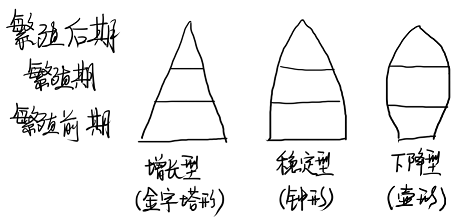
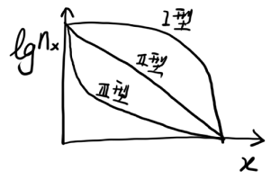
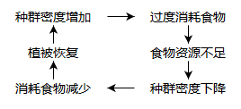

# 第4章 种群及其基本特征

## 4.1 种群的概念

**种群**是在同一时期内占有一定空间的同种生物个体的几何。

* **单体生物**：每一个体都由一个受精卵直接发育而来，各个部分的数目保持不变，形态保持高度稳定，例如各种高等动物

* **构件生物**：由一套构建组成的生物体，例如各种植物和低等动物

  > **构件**：合子发育而来的，在基株上形成的每一个与生死过程相关的可重复的结构单位
  >
  > **无性系分株**：构件生物的各个构件之间的连接消失后形成的许多分离的个体

种群的三个基本特征

* **空间特征**：种群具有一定的分布区域
* **数量特征**：单位面积上的个体数量是变动的
* 遗传特征：种群具有区别于其他种群的基因库

研究种群的意义

* 种群是物种在自然界中存在的基本单位
* 种群是物种进化的基本单位
* 种群是生物群落的基本组成单位

**种群生态学**：研究种群的数量、分布以及种群与其栖息环境中的非生物因素及其他种群的相互作用

## 4.2 种群动态

> **种群动态**研究种群数量在时间和空间上的变动规律。

### 4.2.1 种群的密度和分布

#### 种群的大小和密度

**种群密度**：单位面积/体积/生境中个体的数目

* 单体生物即个体数
* 构件生物须统计合子产生的个体数和每个个体的构件数
* 对进化个体的数量感兴趣时，应当考虑无性系的数量

#### 种群的数量统计

* 易于计数的可采用**总数量调查法**
* 常用的估算方法有**样方法**和**标记重捕法**

#### 种群的空间结构

**内分布型**：组成种群的个体在其生活空间中的位置状态或布局

|                 | 均匀分布         | 随机分布           | 成群分布                                           |
| --------------- | ---------------- | ------------------ | -------------------------------------------------- |
| 形成原因        | 种群间个体的竞争 | 资源分布均匀、丰富 | 资源分布不均匀、以母株为中心传播种子、动物集群分布 |
| $$S^2/\bar{m}$$ | =0               | =1                 | >>1                                                |

**建筑学结构**：植物重复出现的构件的空间排列

### 4.2.2 种群统计学

种群的统计学指标

* 种群密度（最基本特征）
* 初级种群参数：出生率、死亡率、迁入率、迁出率
* 次级种群参数：性比、年龄结构、种群增长率

#### 年龄结构

**年龄结构**：一个年龄群的个体数对整个种群的比率。

> 经历离散发育期的动物（如昆虫）可形成**时期结构**。
>
> 许多植物的年龄可能没有意义，可用**个体大小群**进行划分，例如用质量、覆盖面积等为依据。

**年龄锥体**：横柱从下至上表示不同年龄组，宽度表示数量百分比

* 典型金字塔形锥体：增长型种群
* 钟形锥体：稳定型种群
* 壶形锥体：下降型种群

#### 性比

**性比**：种群中雌雄个体的比例。

> 大多数动物种群的性比接近1:1
>
> 由于生理和行为差异，性比随年龄会有变化。

#### 生命表

**动态生命表**：一组大约同时出生的个体从出生到死亡的命运。

> 这样的一组个体称为**同生群**，这样的研究称为**同生群分析**。

**静态生命表**：根据某一特定时间种群做年龄结构调查资料而编制的。

> 动态生命表难以获得时，采用静态生命表退而求其次。

**生命表的结构**

| 年龄  | 开始存活数 | 存活率                   | 死亡数              | 死亡率                   | 平均存活数                     | 存活个体总年数                 | 生命期望                 |
| ----- | ---------- | ------------------------ | ------------------- | ------------------------ | ------------------------------ | ------------------------------ | ------------------------ |
| $$x$$ | $$n_x$$    | $$l_x=\dfrac{n_x}{n_0}$$ | $$d_x=n_x-n_{x+1}$$ | $$q_x=\dfrac{d_x}{n_x}$$ | $$L_x=\dfrac{n_x+n_{x+1}}{2}$$ | $$T_x=\sum^{\infty}_{t=x}L_t$$ | $$e_x=\dfrac{T_x}{n_x}$$ |

**综合生命表**

| 期    | 开始存活数 | 存活率                   | 每期死亡比率        | 死亡率                                              | 致死力                        | 生产的卵数 | 每一个体生产的卵数       | 原来个体生产的卵数          |
| ----- | ---------- | ------------------------ | ------------------- | --------------------------------------------------- | ----------------------------- | ---------- | ------------------------ | --------------------------- |
| $$x$$ | $$n_x$$    | $$l_x=\dfrac{n_x}{n_0}$$ | $$d_x=l_x-l_{x+1}$$ | $$q_x=\dfrac{d_x}{l_x}\\=\dfrac{n_x-n_{x+1}}{n_x}$$ | $$k_x=\lg{n_x}-\lg{n_{x+1}}$$ | $$F_x$$    | $$m_x=\dfrac{F_x}{n_x}$$ | $$m_xl_x=\dfrac{F_x}{n_0}$$ |

**净生殖率**$$R_0=\sum l_xm_x=\dfrac{\sum F_x}{n_0}$$表示种群世代净增值率，即同生群末每一存活个体所生产的后代总数。

**K-因子分析**：通过分析哪一时期的$$k$$与$$k_{total}=\sum k_x$$的影响最大，从而判断**致死因子**。

#### 存活曲线

以$$\lg{n_x}$$或$$\lg{l_x}$$对$$x$$作图。

* I型：曲线凸型，幼体存活率高，老年死亡率高。如人和大型哺乳动物。
* II型：对角线型，较稳定的死亡率。如鸟类。
* III型：曲线凹形，幼体死亡率高。如产卵鱼类。

> 动物进化的过程近似由III型→II型→I型进化。

#### 种群增长率

**世代时间**$$T=\dfrac{\sum xl_xm_x}{\sum l_xm_x}$$：子代从母体出生到再产子的平均时间

**种群增长率**$$r=\dfrac{\ln R_0}{T}$$

> 增长率与净生殖率成正相关，与世代时间成负相关。

**内禀增长率**$$r_m$$：在实验室理想状态下的增长率

**生殖价**$$V_x=\sum^{w}_{t=x}\dfrac{l_t}{l_x}m_x$$：某一年龄雌体平均能对未来种群增长所做的贡献。

### 4.2.3 种群的增长模型

#### 与密度无关的增长模型

1. 离散增长模型

   $$N_{t+1}=\lambda N_t$$或$$\lg N_t=\lg N_0+t\lg \lambda$$

2. 连续增长模型

   $$\dfrac{dN}{dt}=rN$$或$$N_t=N_0 e^{rt}$$

   可求得翻倍时间$$t=\dfrac{\ln 2}{r}$$

#### 与密度有关的增长模型

逻辑斯谛方程 

* 微分形式$$\dfrac{dN}{dt}=rN(1-N/K)$$
* 积分形式$$N_t=\dfrac{K}{1+e^{a-rt}}$$（a由初值条件确定）

划分为五个时期：开始期、加速期、转折期、减速期、饱和期

**自然反应时间**$$T_R=1/r$$：度量种群受干扰后返回平衡状态所需时间

### 4.2.4 自然种群的数量变动

* 种群增长
* 季节消长
* 种群的波动：不规则波动、周期性波动
* 种群的爆发
* 种群平衡
* 种群的衰落和消亡

### 4.2.5 生态入侵

**生态入侵**：由于人类有意识或无意识地把某种生物代入适宜其栖息和繁衍的地区，其种群不断扩大，分布区逐步稳定地扩展。

判断生物入侵的关键：改变原有生态系统的结构、功能并造成危害

> 外来物种入侵后，通常由一个较长的滞后阶段

## 4.3 种群调节

* 非密度制约因子：对种群作用的大小在各种群密度下都是均一的因子，例如灾难性环境变化
* 密度制约因子：对种群作用大小取决于种群密度高低的因子，例如食物、空间等资源因素

### 4.3.1 外源性种群调节理论

#### 非密度制约的气候学派

* Bodenheimer：（以昆虫为研究对象）生物种群是受对种群增长有利的气候的短暂所限制

#### 密度制约的生物学派

* Nicholoson：非密度制约因子是破坏性的，而非调节性的

* Smith：种群围绕一个“特征密度”而变化，特征密度本身也变化

* Lack：（以鸟类为研究对象）种群调节的原因包括：食物的短缺、捕食、疾病

* Pitelka与Schultz：**营养物恢复学说**

  

#### 折中观点

* A. Milne：环境对物种有利时，密度制约因子决定种群数量；环境对物种不利时，非密度制约因子决定种群数量

### 4.3.2 内源性种群调节理论

* 行为调节（Wyune-Edwards）：社群行为是一种调节种群密度的机制
* 内分泌调节（Christian）：种群数量上升影响激素分泌，抵抗环境压力能力降低（主要适用于兽类）
* 种群遗传调节（Chitty）：种群数量较低时，有利于繁殖力高而进攻性低的个体；种群数量较高时则相反

## 4.4 集合种群动态

### 4.4.1 概念术语

**局域种群**：同一物种，以很高的概率相互作用的个体的集合

**斑块**：局域种群所占据的空间区域

**集合种群**：生境斑块中，在空间上存在隔离，彼此间通过个体扩散而相互联系的局域种群的集合。即一个区域内所有局域种群的集合。

* 适宜生境以离散的斑块形式存在，且可被局域繁殖种群所占据
* 各局域种群存在灭绝风险（避免局域种群过大）
* 生境斑块不可过于隔离
* 各个局域种群动态不能完全同步

**集合种群动态**：被占据生境斑块的比例随时间变化的过程

集合种群动态特征：局域种群的连续周转→局域绝灭→再侵占

> 周转：局域种群的灭绝，以及现存局域种群扩散出的个体在尚未被占据的生境斑块建立新局域种群的过程

### 4.4.2 集合种群理论的意义和应用

* 种群的多度与局域种群灭绝率的瞬间变异度呈负相关
* 生境斑块被占领的概率与板块面积呈正相关，与现存局域种群隔离程度称负相关
* 破碎栖息地导致迁移能力很弱，物种容易灭绝，人工迁移可以防止灭绝

