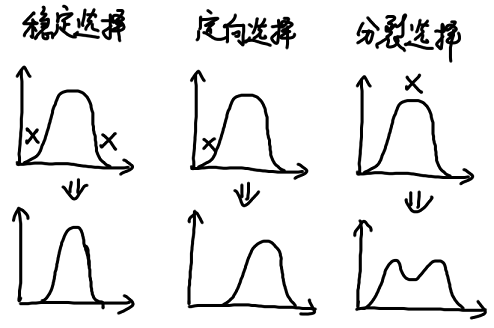

# 第5章 生物种及其变异与进化

## 5.1 物种的概念

生物种具有以下特点：

* 物种是真实的存在，是由内聚因素联系起来的个体的集合
* 物种是一个可随时间进化改变的个体的集合
* 物种是生态系统中的功能单位

## 5.2 种群的遗传、变异与自然选择

### 5.2.1 哈代—温伯格定律

**哈代—温伯格定律**：在一个巨大的、个体交配完全随机、没有其他因素干扰的种群中，基因频率和基因型频率将世代保持不变，这种状态称为种群的**遗传平衡**状态。

* 交配完全随机
* 没有基因突变发生
* 种群充分大
* 没有新基因的迁入
* 所有的基因型都具有相同的适合度

### 5.2.2 进化动力

两种进化动力是**自然选择**和**遗传漂变**。

自然选择的基因频率变化有方向性，遗传漂变的基因频率变化无方向性

#### 自然选择

**多态**：许多等位基因的存在导致种群中多种表现型。

**渐变群**：表现型特征或等位基因频率逐渐改变的种群。

**适合度**：基因型个体的平均生殖力乘以存活率，相当于下一代平均后裔数

**相对适合度**：适合度÷最大适合度

**选择系数**：1－相对适合度

#### 遗传漂变

**遗传漂变**：基因频率的随机变化，仅偶然出现，与种群大小成反比

**固定**：等位基因从种群中完全丢失，基因座上只留下一个基因

### 5.2.3 遗传瓶颈与建立者效应

#### 遗传瓶颈

**瓶颈**：种群由于环境灾难或过捕导致数量急剧下降

经历遗传瓶颈后，遗传变异迅速降低，容易导致灭绝

#### 建立者效应

**建立者种群**：以一个或几个个体为基础，在空白生境建立一个新的种群

**建立者效应**：建立者种群与母种群的差异很大

### 5.2.4 表型的自然选择模型

表型的自然选择模型

* 稳定选择：中间个体最适，淘汰两侧极端个体
* 定向选择：对一侧极端个体有利，对另一侧不利
* 分裂选择：两侧表型适合度高，中间表型不适

其他生物学单位的选择

* 配子选择
* 亲属选择
* 群体选择
* 性选择

## 5.3 物种形成

### 5.3.1 物种形成的过程

**基因流**：基因组种群内通过相互杂交、扩散和迁移进行的运动

**地理物种形成学说**

* 地理隔离
* 独立进化
* 繁殖隔离机制的建立

**繁殖隔离机制**：阻止种间基因流动，致使生境非常相近的种保持其独特性的任何特性

| 阻止杂合子形成                                               | 降低杂合子的生存力或繁殖力             |
| ------------------------------------------------------------ | -------------------------------------- |
| 生态或生境隔离 季节或时间隔离 性隔离 机械隔离 不同传粉者隔离 配子隔离 | 杂种不存活 杂种不育 杂种受损 |

### 5.3.2 物种形成的方式

#### 异域物种形成

* （K-繁殖对策）大范围地理分隔使两种群独立进化
* （r-繁殖对策）处于种分布区极端边缘的小种群，从原种群分离出去

#### 邻域物种形成

**环球分布种**：在很大地理面积内分布的物种

#### 同域物种形成

* 存在多型适应两个不同的生境或者生态位，对其生境有所选择
* 植物通过形成多倍体

### 5.3.3 一些物种形成的特点

#### 植物物种形成的特点

* 易于自发形成多倍体
* 易于产生杂种后代，杂交能育性高

#### 岛屿物种形成的特点

* 和大陆隔离，易于形成适应于当地的特有种

> **适应辐射**：由一个共同点祖先起源，在进化过程中分化成许多类型，适应于各种生活方式的现象

