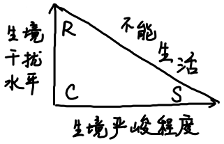
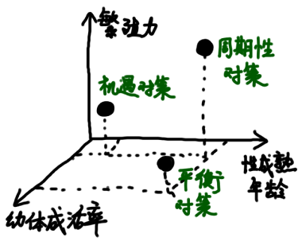

# 第6章 生活史对策

**生活史**：从出生到死亡所经历的全部过程

**生态对策/生活史对策**：生物在生存斗争中获得的生存对策

## 6.1 能量分配与权衡

> **达尔文魔鬼**：一个理想的具有可使繁殖力最大化特征的假定生物体，出生后短期内达到大型成体的大小，生产许多大个体后代并长寿

达尔文魔鬼不存在，因为在生长和繁殖间存在能量分配和权衡，生长率和繁殖力呈负相关

* 单次生殖：资源分配给一次大批繁殖
* 多次生殖：均匀随时间分开分配

## 6.2 体形效应

物种体形大小与寿命呈明显正相关，与内禀呈明显负相关

* 体型大、寿命长的个体：更好地维持调节功能，种内、种间竞争力更强
* 体型小、寿命短的个体：可产生更多不同遗传特性的后代，增加生态适应幅度

## 6.3 生殖对策

### 6.3.1 r-选择和K-选择

|          | r-选择                                       | K-选择                                         |
| -------- | -------------------------------------------- | ---------------------------------------------- |
| 选择结果 | **高繁殖力**                                 | **高存活力**                                   |
| 选择倾向 | 发育快，增长力高，提早生育，体型小，单次生殖 | 发育缓慢，竞争力高，延迟生育，体型大，多次生殖 |
| 死亡     | 无规律，非密度制约                           | 比较规律，密度制约                             |
| 存活     | III型曲线                                    | I型、II型曲线                                  |
| 种群大小 | 低于K值                                      | 接近K值                                        |
| 竞争     | 不紧张                                       | 紧张                                           |

### 6.3.2 生殖价和生殖效率

**生殖价**＝**当前繁殖输出**＋**未来繁殖输出**

* 预期寿命短：当前繁殖输出高
* 预期寿命长：未来繁殖输出高

个体的生殖价在出生后升高，随老龄化降低

### 6.3.3 植物的生活史对策

#### 生境分类

* 高-CR生境：高繁殖付出，竞争剧烈，对小形成体捕食严重
* 低-CR生境：低繁殖付出，竞争弱，大型个体捕食压力大

#### 两面下注理论

* 成体死亡率与幼体死亡率相当：多次生殖
* 幼体死亡率低于成体：单次生殖

#### CSR三角形

|        | 低严峻度         | 高严峻度             |
| ------ | ---------------- | -------------------- |
| 高干扰 | R-选择：杂草对策 | 不能存活             |
| 低干扰 | C-选择：竞争对策 | S-选择：胁迫忍耐对策 |

### 6.3.4 机遇、平衡和周期性生活史对策

* 机遇对策：幼体成活率低、后代数量少、性成熟早
* 平衡对策：幼体成活率高、后代数量少、性成熟晚
* 周期性对策：个体大、产大量小卵、性成熟晚

## 6.4 滞育和休眠

昆虫的**休眠**也称为**滞育**。

**潜生/隐生**现象：几乎停止所有新陈代谢的休眠现象，可持续多年

**蛰伏**：临时将体温降到接近环境温度来节约能量

## 6.5 迁移

#### 空间上的迁移

**迁徙**：方向性运动

**扩散**：离开出生或繁殖地的非方向性运动

#### 时间上的迁移

* 反复的往返旅行
* 单次往返旅行
* 单程旅行

## 6.6 复杂的生活周期

举例

* **变态**：个体生活史中的形态学变化

* 植物单倍体到二倍体

原因：**生境利用最优化**

## 6.7 衰老

衰老进化模型

* **突变积累**：突变基因的选择压力随年龄的增加而下降

  > 早期”坏基因“容易淘汰，晚期”坏基因“容易保持

* **颉颃性多效**：对早期繁殖有利，对生命晚期有恶劣影响的基因

  > 高繁殖力的基因与低存活力有关