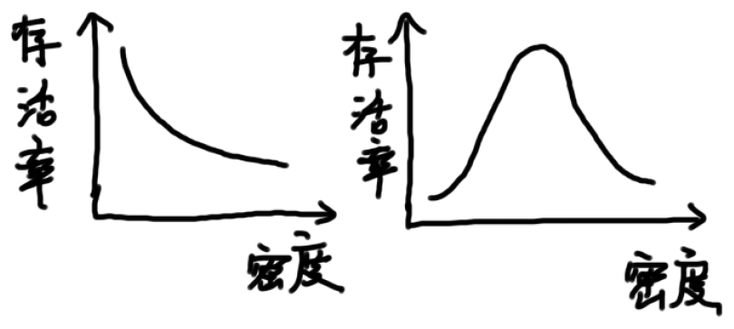
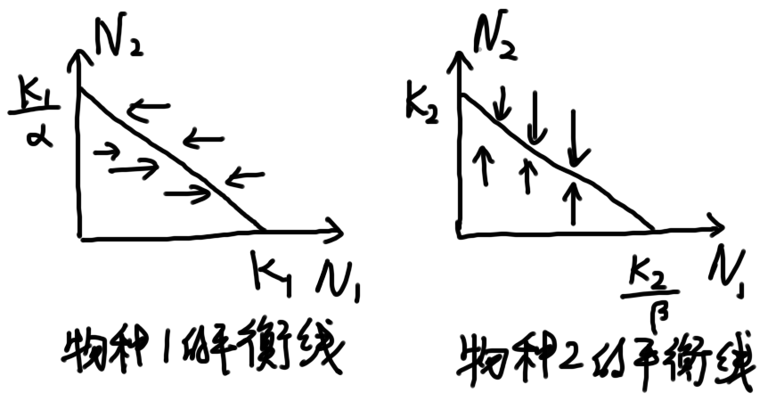
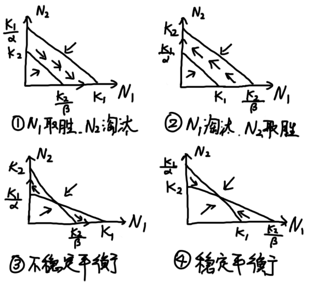
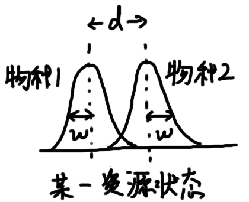
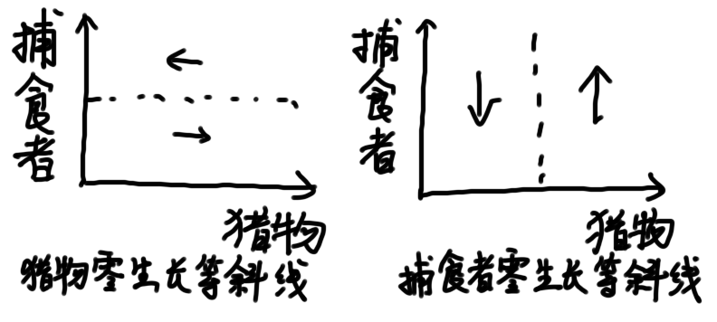
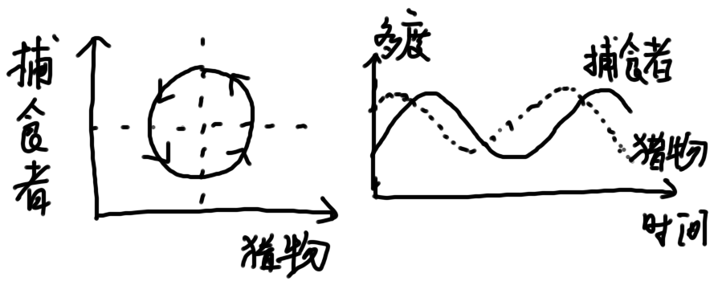
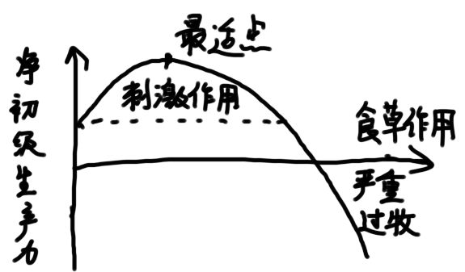

# 第7章 种内与种间关系

种内和种间关系分类

|                                  | 种内关系          | 种间关系 |
| -------------------------------- | ----------------- | -------- |
| 利用同样有限资源，导致适合度降低 | 种内竞争          | 种间竞争 |
| 摄食另一个体的全部或部分         | 自相残杀          | 捕食     |
| 个体紧密关联生活，具有互惠利益   | 利他主义/互利共生 | 互利共生 |
| 个体紧密关联生活，宿主付出代价   | 种内寄生          | 寄生     |

根据影响结果对种间关系分类

| 相互作用类型 | 对A的作用 | 对B的作用 |
| ------------ | --------- | --------- |
| 竞争         | －        | －        |
| 捕食/寄生    | ＋        | －        |
| 中性         | 0         | 0         |
| 偏害共生     | 0         | －        |
| 偏利共生     | 0         | ＋        |
| 互利共生     | ＋        | ＋        |

> **拟寄生**：拟寄生者在寄主体上或体内产卵，造成寄主死亡。

## 7.1 种内关系

### 7.1.1 密度效应

#### 最后产量恒值法则

**最后产量恒值法则**：不管初始播种密度如何，植物的最后产量差不多总是一样的（other things being equal）

原因：高密度情况下，竞争激烈，植物生长率低，个体变小

$Y=\bar{W}\times d=\rm{const.}$

> $Y$：单位面积产量
>
> $\bar{W}$：植物个体平均质量
>
> $d$：密度

#### －3/2自疏法则

**自疏**：竞争使较少量的较大个体存活下来

**－3/2自疏法则**：密度与生物个体大小在双对数图上具有－3/2斜率

$\bar{W}=C\times d^{-3/2}$或$$\lg{\bar{W}}=\lg{C}-3/2 \log{d}$$

### 7.1.2 性别生态学

#### 两性细胞结合和有性繁殖

无性繁殖的优越性：

1. 可迅速增殖，占领暂时性新栖息地
2. 母体给下代复制的基因组是有性繁殖的两倍

生物选择有性繁殖的原因：产生更多变异类型的后代，有利于生存竞争

#### 性比

大多数种群的性比是1:1

**Fisher氏性比理论**：雌雄两性应有**相等投入**，这是**稀少型有利**的结果。

> **稀少型有利**：个体少的性别竞争少，适合度高

性比偏离的情形：

* 若一个性别个体对母体要求的花费高，则花费较少的性别个体多
* 不同年龄的性比因雌雄死亡率不同而变化
* **局域资源竞争**紧张，雄仔向外扩散
* **局域交配竞争**紧张，同胞姐妹存在交配竞争，性比偏雌

#### 性选择

对于后代的投入越大，该性别就更加挑剔

性选择的途径：

* **性内选择**：同性成员间的配偶竞争，可解释打斗武器的发生
* **性间选择**：偏爱异性的某个独特特征，可解释明显无用的身体构建

**让步赛理论**：拥有质量好的大尾，表明必须有好的基因

**Fisher氏私奔模型**：雄性诱惑性特征被雌性选择，因此将继续进化

#### 动物的婚配制度

**婚配制度**：群内婚配的类型，包括配偶数目、配偶持续时间、对后代的抚育等。

* 单配制：一雄一雌，常见于鸟类
* 多配制
  * 一雄多雌：最普遍
  * 一雌多雄：不多见

影响因素：主要是资源的分布，高质而分布均匀的资源利于形成单配制

### 7.1.3 领域和社会等级

#### 领域

**领域**：个体、家庭或其他社群单位所占据，积极保卫不让同种其他成员侵入的空间

**领域行为**：保卫领域的行为

* 鸣叫、气味标志、特异姿势宣告领域
* 威胁、进攻驱赶入侵者

具有领域性的动物主要是脊椎动物中的鸟兽和一些节肢动物

意义：减少争斗，维护社群稳定，保证社群成员获得资源

领域大小的影响因素

* 领域大小与占有者体重正相关
* 食肉动物>食草动物
* 随生活史而变化，尤其是繁殖节律

#### 社会等级

**社会等级**：动物种群中各个动物的地位具有一定顺序的等级现象

意义：减少不必要的内耗，保证强者优先交配生育

### 7.1.4 他感作用

**他感作用**：一种植物向体外分泌化学物质，对其他植物产生直接或间接的影响

分泌物称为**克生物质**，是生存斗争的一种特殊形式

生态学意义

* 影响群落组成
* 引起植物群落演替
* 影响农林业生产管理

### 7.1.5 集群生活

缺点

* 招引天敌注意
* 加剧资源竞争
* 传染病流行

意义

* 改变小气候条件
* 利于取食
* 共同防御天敌
* 利于繁殖和抚育
* 容易迁移迁徙

**阿利氏规律**：对于一些动物，存活率与密度负相关；但对于一些动物，种群有一个最适密度，过密和过疏都是不利的

## 7.2 种间关系

### 7.2.1 种间竞争

**高斯假说/竞争排斥原理**：在一个稳定的环境内，受资源限制但利用方式完全相同的物种，不能长期共存。即完全的竞争者不能共存。

竞争的类型

* **利用型竞争**：损耗有限的资源，个体不直接相互作用
* **干扰型竞争**：竞争个体间直接相互作用

竞争的特征

* **竞争结果的不对称性**：一个体的竞争代价常远高于另一个体
* 对一种资源的竞争，会影响对另一种资源的竞争结果

**似然竞争**：两种猎物以共同的捕食者为中介产生的相互影响

#### Lotka-Volterra模型

数学模型

$$\dfrac{dN_1}{dt}=r_1N_1(1-\dfrac{N_1}{K_1}-\alpha\dfrac{N_2}{K_1})$$

$$\dfrac{dN_2}{dt}=r_2N_2(1-\dfrac{N_2}{K_2}-\beta\dfrac{N_1}{K_2})$$

> $\alpha$：物种2对物种1的竞争系数
>
> $\beta$：物种1对物种2的竞争系数
>
> $\dfrac{1}{K_1}$：物种1的种内竞争强度
>
> $\dfrac{1}{K_2}$：物种2的种内竞争强度
>
> $\dfrac{\alpha}{K_1}$：物种2对物种1的种间竞争强度
>
> $\dfrac{\beta}{K_2}$：物种1对物种2的种内竞争强度

竞争结局

> ① 物种1的种间竞争大；物种2的种内竞争大：物种1取胜
>
> ② 物种1的种内竞争大；物种2的种间竞争大：物种2取胜
>
> ③ 物种1和物种2都是种间竞争强度大，不稳定平衡
>
> ④ 物种1和物种2都是种内竞争强度大，稳定平衡

#### 生态位理论

**生态位**：物种在生物群落或生态系统中的地位和角色

* **基础生态位**：在没有竞争和捕食胁迫理想条件下，物种能够占据的生态位空间
* **实际生态位**：物种实际占有的生态位空间

> d：峰值间距离；w：标准差

* d>w：种内竞争大，种间竞争小，促进生态位接近
* d<w：种内竞争小，种间竞争大，促进生态位分开
* d=w：**极限相似性**

#### 竞争释放与性状替换

**竞争释放**：缺乏竞争者时，物种会扩张实际生态位

**性状替换**：竞争产生的生态位收缩导致形态性状发生变化

#### 种间竞争与空间、时间异质性

**浮游生物悖论**：海上层结构简单的生境中持续存在大量浮游生物种类

由于极端天气或死亡，环境中会产生**缝隙**，最先进入缝隙的是竞争力较弱而扩散力强的个体

**优先权**效果：在板块生境中，竞争优势常取决于哪个个体先占据该地点

### 7.2.2 捕食

捕食的类型：典型的捕食、食草、寄生

捕食者的分类

* 食草动物、食肉动物、杂食动物
* 特化种、泛化种
* 单食者、寡食者、广食者、寄生者

逃避捕食的方法：（植物）化学防御、（动物）行为对策

#### 捕食者与猎物

捕食者与猎物的**协同进化**：一个物种的性状作为对另一个物种的反应而进化

**红皇后效应**：环境条件稳定时，一个物种的进化改进可能构成对其他物种的竞争压力，种间关系可推动生物进化

> 红皇后：必须不停奔跑，才能留在原地

精明的捕食者大都不捕食正当繁殖年龄的猎物

##### Lotka-Volterra捕食者-猎物模型

猎物方程：$\dfrac{dN}{dt}=r_1N-\varepsilon PN$

捕食者方程：$\dfrac{dP}{dt}=-r_2P+\theta PN$

模型预言的周期性震荡对外界干扰很敏感

##### 捕食者对猎物种群大小的影响

* 可能没有明显影响
  * 捕食者的作用只占猎物总死亡率的很小一部分
  * 捕食者只是利用了超出环境所能支持的那一部分个体
* 可能有明显影响

##### 捕食对策与食物选择

**捕食对策**：动物为获得最大的觅食效率而采取的方法

**最佳捕食对策**：使动物在单位捕食时间/投入所获得的能量最大

* **搜寻者**食谱倾向于广谱化
* **处理者**食谱倾向于特化
* 在生产力较低的生境中，捕食者食谱更宽
* 捕食者通常拒绝利润低的食物

#### 食草作用

植物的防卫方式：毒性和差的味道、防御结构

食草作用对植物净生产量的影响

### 7.2.3 寄生作用

寄生物的分类

* **微寄生物**：在寄主体内或表面繁殖
* **大寄生物**：在寄主体内或表面生长，但不繁殖
* **拟寄生物**：在昆虫身上或体内产卵，通常导致寄主死亡

#### 寄生物与寄主的协同进化

寄生物：神经系统和感官系统退化、生殖系统发达、生活史复杂

寄主：强烈的免疫反应、整理行为、迁移、（植物）局部细胞死亡

进化结果使得危害逐渐减弱

#### 社会性寄生物

强迫寄主动物为其提供食物或其他利益，例如鸟类的**窝寄生**（包括种内、种间）

### 7.2.4 互利共生

#### 专性与兼性互利共生

* 专性互利共生：永久性成对组合的生物，一方或双方不能独立生活。例如大多数**共生体**
* 兼性互利共生：不互相依赖着生存，占大多数

#### 互利共生的类型

* 体外互利共生
* 细胞外互利共生
* 细胞内互利共生

#### 互利共生与进化

真核细胞来源与原核共生体

