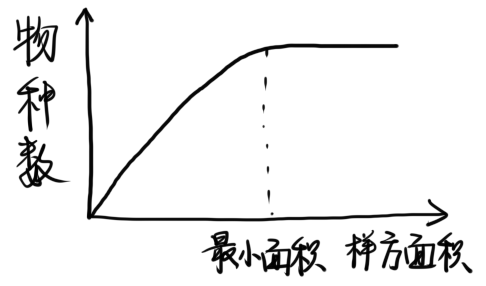
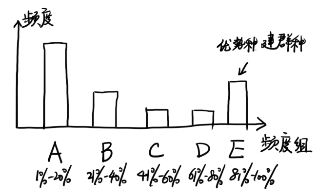
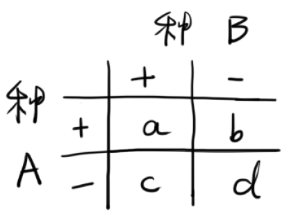
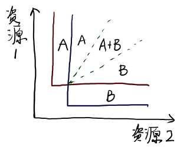

# 第8章 群落的组成与结构

## 8.1 生物群落

### 8.1.1 生物群落的概念

**群落**：在相同时间聚集在同一地段上的各物种种群的集合

**群落生态学**：研究群落与环境相互关系的科学

### 8.1.2 群落的基本特征

* 具有一定的种类组成
* 群落中各物种之间是相互联系的
* 群落有自己的内部环境
* 具有自己的结构
* 具有一定的动态特征
* 具有一定的分布范围
* 具有边界特征
* 各物种不具有同等的群落学重要性

### 8.1.3 对群落性质的两种对立观点

#### 机体论学派

代表人物：Clements

群落像一个有机体，有诞生、生长、成熟、死亡的不同发育阶段，可以类比成一个有机体的发育时期

#### 个体论学派

代表人物：Gleason

群落与生物有机体存在很大差异

* 生物有机体的死亡必然导致器官死亡，而群落衰亡不会导致种群消失
* 群落的发育体现在物种更替和种群数量消长
* 群落不可能在不同生境条件下繁殖而保持一致性
* 相同物种的个体在遗传上密切相关，同一群落类型之间却没有遗传的联系

## 8.2 群落的种类组成

### 8.2.1 种类组成的性质分析

#### 植物群落物种组成的调查方法

1. 选择样地、设置抽样样方

   **样地**：能够反映植物群落基本特征的一定地段

   样地选择标准：种类成分分布均匀一致、群落结构完整、层次分明、生境调节一致，选在群落中心的典型部分

2. 设置抽样样方

   **最小面积**：基本上能够表现出某群落类型植物种类的最小面积

   

   组成群落的种类越丰富，最小面积越大

#### 常用的群落成员型

1. 优势种、建群种

   > **优势种**：对群落结构和群落环境形成有明显控制作用的植物种
   >
   > ​	不同层次可以有各自的优势种
   >
   > **建群种**：优势层的优势种
   >
   > ​	建群种只有一个的群落称为**单建群种群落**，建群种有多个时称为**共建群种群落**

2. 亚优势种

   > **亚优势种**：个体数量和作用次于优势种，但在决定群落性质和控制环境方面扔起一定作用的物种

3. 伴生种

   > **伴生种**：与优势种相伴存在，但对群落环境的影响不起主要作用

4. 偶见种、罕见种

### 8.2.2 种类注册的数量特征

#### 多度和密度

**多度**：对植物群落中物种个体数目多少的一种估测指标

**相对密度**：某一植物的个体数÷全部植物种个体数

**密度比**：某一物种的密度÷密度最高物种的密度

#### 盖度

**盖度**（投影盖度）：植物体地上部分的垂直投影面积÷样地面积、

> * 分盖度：种盖度
> * 层盖度：种组盖度
> * 总盖度：群落盖度
>
> 由于枝叶互相重叠，分盖度之和大于总盖度

**相对盖度**：某一物种分盖度÷所有分盖度之和

**盖度比**：某一物种分盖度÷最大物种盖度

**基盖度**（真盖度）：植物基部的覆盖面积

> 草原群落：离地1英寸（2.54cm）处断面积
>
> 森林群落：树木胸高（1.3m）处断面积

**显著度**：乔木的基盖度

#### 频度

**频度**：某种植物出现的样方数占整个样方数的百分比

**Raunkiaer频度定律**：按频度低到高划分为五组，A＞B＞C ≥ D＜E

一般而言，E级越高越稳定，若BCD级比例增高，预示着植被分化和演替的趋势

#### 重要值

重要值＝相对密度＋相对频度＋相对优势度（相对基盖度）

### 8.2.3 种的多样性

**物种多样性**有两层含义

* **丰富度**：物种数目的多寡
* **均匀度**：各物种个体数目的均匀程度

#### 辛普森多样性指数

随机取样的两个个体属于不同种的概率

$$D=1-\sum\limits^S_{i=1}P_i^2$$

> $D$：辛普森多样性指数
>
> $P_i$：物种$i$的个体数占总个体数的比例

#### 香农-威纳指数

$$H=-\sum\limits_{i=1}^S P_i\log{P_i}$$

> 如果群落中有$S$个物种，则
>
> * $H_{max}=\log{S}$ （每一物种恰有1个个体）
> * $H_min=0$（全部个体为同一物种）

均匀度$E=\dfrac{H}{H_{max}}=\dfrac{H}{\log{S}}$

不均匀性$R=\dfrac{H_{max}-H}{H_{max}-H_{min}}=\dfrac{\log{S}-H}{\log{S}}$

#### 不同空间尺度的多样性测度

* **α-多样性**：栖息地或群落中的物种多样性
* **β-多样性**：在地区尺度上物种组成沿着某个梯度方向从一个群落到另一个群落的变化率
* **γ-多样性**：一个或多个地区内穿过一系列的群落的物种多样性

### 8.2.4 物种多样性在空间上的变化规律

* 随纬度增高而降低
* 随海拔升高而降低
* 在水中随深度增加而降低

### 8.2.5 解释物种多样性空间变换规律的学说

* 进化时间学说：热带群落古老，进化时间长，多样性高
* 生态时间学说：物种分布区的扩大需要时间
* 空间异质性学说：热带的环境更加复杂，提供生境多
* 气候稳定学说：热带气候是最稳定的
* 竞争学说：热带竞争激烈，是进化和生态位分化的主要动力
* 捕食学说：捕食者减轻了被食者的竞争
* 生产力学说：热带植物生产力高

### 8.2.6 种间关联

**正关联**：两个物种一起出现的次数高于期望

> 可能由于一个物种依赖另一个物种；或者受环境因子影响而生长在一起

**负关联**：两个物种一起出现的次数低于期望

> 可能由于空间排挤、竞争、他感作用；或者对环境的不同要求

种间关联可采用**关联系数**度量

$$V=\dfrac{(ad-bc)}{\sqrt{(a+b)(c+d)(a+c)(b+d)}}$$

关联系数的显著性可采用λ²检验法进行检验

## 8.3 群落的结构

### 8.3.1 群落的结构单元

群落的空间结构取决于各物种的**生活型**以及相同生活型物种组成的**层片**。

#### 生活型

**生活型**是生物对外界环境适应的外部表现形式。

* **高位芽植物**：芽或顶端嫩枝位于离地25cm以上
* **地上芽植物**：芽或顶端嫩枝位于接近地表
* **地面芽植物**：在不利季节，地上部分死亡，地下部分存活，地面处有芽
* **地下芽植物**：度过恶劣环境的芽位于地下或水体中
* **一年生植物**：只能在良好季节中生长，以种子形式度过不良季节

**生活型谱**：某个植物群落内各生活型的数量对比关系

#### 层片

**层片**：相同生活型或相似生态要求的种组成的机能群落

### 8.3.2 群落的垂直结构

植物群落结构的基本特征：**成层性**

> 乔木地上成层结构称为**林相**

​	原因：种群之间、种群与环境之间相互竞争与选择的结果

​	依据群落成层性的复杂程度，可对生境条件作出诊断

动物的分层现象：主要与食物有关，也与微气候有关

水生动物的分层现象：主要原因有阳光、温度、食物、含氧量

### 8.3.3 群落的水平结构

主要特征：**镶嵌性**

> **镶嵌性**：植物个体在水平方向上的分布不均匀而形成许多小群落
>
> 原因是生态因子不均匀、群落内部环境不一致、动物活动、人类影响

### 8.3.4 群落的时间结构

群落的时间结构：不同植物种类的生命活动在时间上的差异，导致结构部分在时间上相互更替

时间结构具有周期性，群落季节性的外貌称为**季相**

### 8.3.5 群落交错区与边缘效应

**群落交错区**：两个或多个群落之间的过渡区域

**边缘效应**：群落交错区种的数目及一些种的密度增大的趋势

主要特征

* 是多种要素的联合作用和转换区，生物多样性高
* 抗干扰能力弱
* 生态环境变化速度快

## 8.4 群落组织——影响群落结构的因素

### 8.4.1 生物因素

#### 竞争

**同资源种团**：群落中以同一方式利用共同资源的物种集团

* 同资源种团是群落的亚结构单位
* 同资源种团内的种间竞争十分激烈

**关键种**：对群落具有重要和不相称的影响的物种

Tilman模型

#### 捕食

* 具选择性的捕食者：如果被选择的喜食种属于优势种，则捕食能提高多样性
* 泛化捕食者：适度捕食可以使竞争力弱的种生存，多样性提高
* 特化捕食者：很容易控制被食物种，是生物防治的理想对象

### 8.4.2 干扰对群落结构的影响

**干扰**：对正常过程的打扰或妨碍

干扰常常造成联系群落中出现**断层**。

#### 断层的抽彩式竞争

**抽彩式竞争**：哪一种是优胜者完全取决于随机因素

抽彩式竞争出现的条件：

* 群落中存在许多入侵断层能力相等，耐受断层中物理环境能力也相等的物种
* 任何一个物种在其生活史过程中能组织后入侵的其他物种的再入侵

#### 断层形成的频率

**中度干扰假说**：中等程度的干扰能维持高多样性

* 如果干扰频繁，先锋种就不能发展到演替中期，多样性低
* 如果间隔期很长，演替过程可发展到顶极，多样性不高
* 中等干扰允许更多的物种入侵和定居

### 8.4.3 空间异质性与群落结构

空间异质性的程度越高，就有更多的小生境，允许更多的物种生存

### 8.4.4 岛屿与群落结构

#### 海岛的物种数-面积关系

$$S=CA^Z$$

> S：物种数；A：面积；Z、C：两个常数

岛屿面积越大，物种数越多

#### MacArthur平衡说

岛屿上的物种数取决于物种迁入和灭亡的平衡

岛屿面积越大、距离大陆越近，物种数越多

#### 岛屿与集合种群

**集合种群**：含有通过迁入迁出交换个体的许多种群

如果景观之间具有廊道或绿色通道，集合种群之间的物种移动会更便利

#### 岛屿群落的进化

岛屿与大陆隔离，容易形成新物种

岛屿的物种进化＞迁入；大陆的物种迁入＞进化

* 生物的迁移和扩散能力不同，岛屿和大陆是相对的
* 离大陆遥远的岛屿上，特有种较多
* 岛屿群落可能是物种未饱和的

#### 岛屿生态与自然保护

大保护区和小保护区的考虑

* 若每一小保护区支持的是一些相同的种，则大保护区能支持更多种
* 隔离的小保护区能更好防止传播流行病
* 在相当异质的区域中，多个小保护区能提高空间异质性
* 对密度低、增长率慢的大型动物，保护区不能太小，否则容易发生近交和漂变

### 8.4.5 一个物种丰富度的简单模型

> $R$：一维资源连续体；$\bar{n}$：平均生态位宽度；$\bar{\sigma}$：平均生态位重叠

* $R$越大、$\bar{n}$越小、$\bar{\sigma}$越大，群落将含有更多的物种数
* 群落饱和度越高，就越能含有更多的物种数

捕食对群落结构的影响

* 捕食者可能消灭某些物种，资源未充分利用，降低物种数
* 捕食使一些种数量低于K值，降低种间竞争，提高$\bar{\sigma}$，提高物种数

岛屿群落发育不全的原因

* 面积小，资源范围少，$R$较小
* 面积小，物种被消灭的风险大，群落饱和度低
* 适宜的物种可能未迁入岛中

### 8.4.6 群落结构形成的平衡说与非平衡说

**平衡说**：共同生活在同一群落中的物种处于一种稳定状态，群落的变化是干扰引起的

**非平衡说**：组成群落的物种始终处在变化中，群落不存在全局稳定性，只存在抵抗性和恢复性

平衡说和非平衡说的区别

* 注意点是系统处于平衡点的性质，还是时间和变异性
* 把群落视为封闭系统还是开放系统