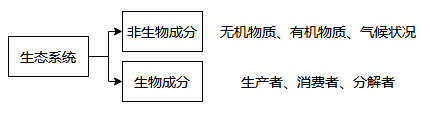
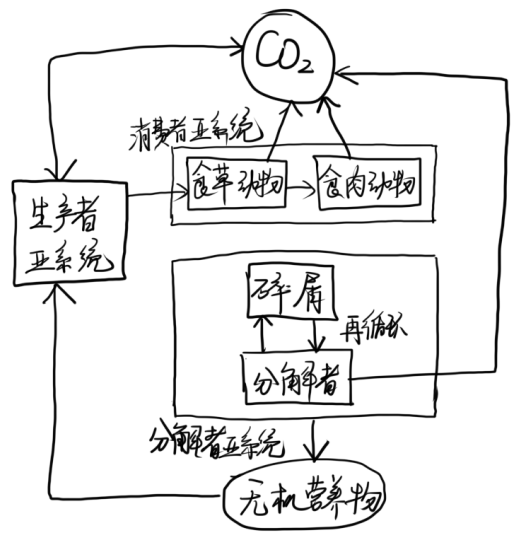

# 第11章 生态系统的一般特征

## 11.1 生态系统的基本概念

**系统**：彼此间相互作用、相互依赖的事物有规律地联合的集合体

* 由许多成分组成
* 各成分之间是彼此互相联系、互相作用的
* 具有独立、特定的功能

**生态系统**：一定空间中共同栖居着的所有生物与其环境之间由于不断地进行物质循环和能量流动而形成的统一整体。

## 11.2 生态系统的组成和结构

### 11.2.1 生态系统的组成

* 非生物环境：参加物质循环的无机物、联系生物和非生物成分的有机物、气候和其他物理条件
* 生产者：能以简单的无机物制造食物的自养生物
* 消费者：直接或间接依赖生产者制造的有机物的异养生物
* 分解者：异养生物，将动植物体的复杂有机物分解为简单化合物，并放出能量

### 11.2.2 生态系统的结构

> * **初级生产**：自养生物的生产过程，生产者通过光合作用合成有机物，使生产者的生物量增加
> * **次级生产**：异养生物的再生产过程，消费者摄食有机物，通过消化、吸收、再合成，增加动物的生物量

## 11.3 食物链和食物网

**食物链**：各种生物按取食和被食的关系排列的链状顺序

> 只有生物群落组成中核心、数量占优的种类，食物联系才比较稳定

* **捕食食物链**：以食草动物吃植物的活体开始
* **碎屑食物链**：从分解动植物尸体或粪便中的有机物开始
* **辅助食物链**：寄生物和食物动物构成

## 11.4 营养级和生态金字塔

**营养级**：处于食物链某一环节上所有生物种的综合

生态系统中的能流是单向流动、逐级减少的

* 各营养级消费者不可能百分之百利用前一营养级的生物量，总有自然死亡和被分解者分解
* 各营养级的同化率不是百分之百，总有排泄物被分解者分解
* 生物维持自身活动，总要消耗能量变成热能耗散

**生态锥体**

* **能量锥体**：最能保持金字塔形
* **生物量锥体**：海洋生态系统中，浮游生物的高周转使其可能倒置
* **数量锥体**：生产者个体大、消费者个体小，则可能倒置

## 11.5 生态效率

能流参数

* 摄食量（$I$）：生物摄取的能量
* 同化量（$A$）：植物光合作用固定的能量/动物消化后吸收的能量
* 呼吸量（$R$）：呼吸等新陈代谢消耗的全部能量
* 生产量（$P$）：$P=A-R$

**传递效率**：能流过程中各个不同点上能量的比值

* 同化效率$A_e=A_n/I_n$
* 生产效率$P_e=P_n/A_n$
* 消费效率$C_e=I_{n+1}/P_n$
* 林德曼效率$L_e=I_{n+1}/I_n=A_eP_eC_e$
* 标准效率$A_{n+1}/A_n$

## 11.6 生态系统的反馈调节与生态平衡

**生态平衡**：生态系统通过发育和调节所达到的一种稳定状况，包括结构、功能、能量输入输出的稳定

**生态危机**：由于人类盲目活动而导致局部地区甚至整个生物圈的结构和功能失衡，从而威胁人类生存

