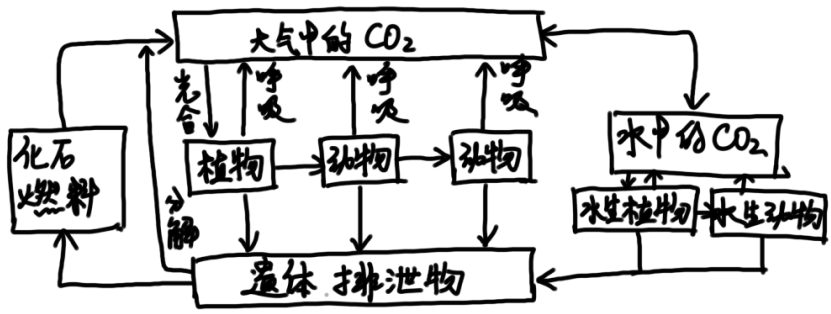
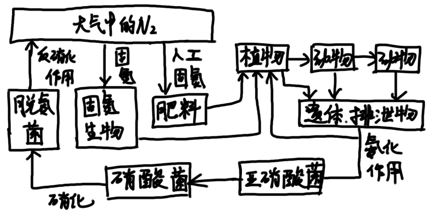

# 第13章 生态系统的物质循环

## 13.1 物质循环的一般特征

#### 物质循环的特征

* 物质循环和能量流动总是相伴发生的
* 能量流动是单向的，物质能反复利用
* 热量一旦耗散就不能做功或合成生物体，但营养物质的总量是不变的

#### 研究物质循环的尺度

* 全球循环（生物地球化学循环）：水循环、气体型循环、沉积型循环
* 局域循环

#### 研究物质循环的模型

* 分室（库）：系统中元素的各种状态
* 流通率（通量率）：单位时间进出库的流动量

#### 全球生物地球化学循环的分类

* 水循环

* 气体型循环

  > 有气体分子参与循环，大气和海洋是主要贮存库

* 沉积型循环

  > 没有气体形态参与，主要通过岩石风化和沉积物分解

气体型循环和沉积型循环都受太阳能驱动，依托于水循环

## 13.2 全球水循环

> 库的单位为$\rm{km^3}$，流通率单位为$\rm{km^3/a}$

* 大循环：海陆间的水循环
* 小循环：海洋或陆地内部的水循环

## 13.3 碳循环

释放二氧化碳的库称为**源**，吸收二氧化碳的库称为**汇**。

人类活动释放的25%的碳尚未研究清楚，即**失汇**现象。

## 13.4 氮循环

* 固氮作用：氮气转化为氨的过程

  > 参与的微生物把偶偶固氮菌、根瘤菌、蓝细菌等
  >
  > * 在全球尺度平衡反硝化作用
  > * 在局域尺度上也很重要
  > * 大气中的氮进入生物循环的唯一途径

* 氨化作用：蛋白质水解为氨基酸，进而释放出氨气

* 硝化作用：氨氧化为亚硝酸盐，进而氧化为硝酸盐

* 反硝化作用：硝酸盐还原为亚硝酸盐，进而还原成氮气

## 13.5 磷循环

磷从陆地土壤库通过河流运输到海洋，海洋中的磷以钙盐形式沉淀

磷很难从海洋返回陆地，因此是不完全的循环

## 13.6 硫循环

硫循环既是沉积型，也是气体型

硫从陆地进入大气的途径：火山爆发、沙尘、化石燃料释放、森林火灾和湿地释放

硫从大气返回陆地的途径：干沉降和降水

## 13.7 元素循环的相互作用

**元素循环的相互作用**：自然界的元素循环是密切关联和相互作用的

> 例如：
>
> * 光合作用与呼吸作用中，碳和氧循环是互相联结的
> * 海洋生态系统的初级生产速率受到浮游植物氮/磷比影响