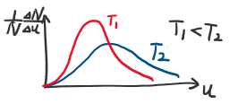
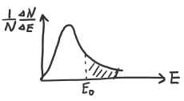
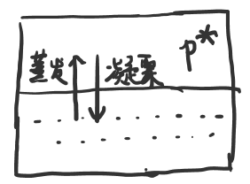
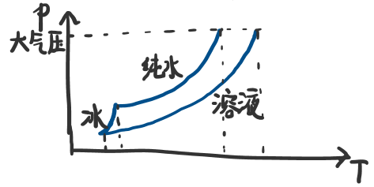

# 第1章 化学基础知识

## 1.1 气体

### 1.1.1 气体的状态方程

#### （1）理想气体

##### 假设

* 忽略分子体积
* 忽略分子间的吸引排斥
* 分子所有碰撞完全弹性

##### 适用条件

高温低压

##### 理想气体状态方程

$$pV=nRT$$

> $R=8.314 J\cdot mol^{-1}\cdot K^{-1}=8.314\times kPa\cdot dm^{3}\cdot mol^{-1}\cdot K^{-1}$

#### (2) 实际气体

##### 体积修正

考虑气体分子本身的体积：每mol气体分子的体积为b

$$V=V_{实}-nb$$

##### 压强修正

考虑内层分子对外层分子的引力

> $p=p_内+p_实$
>
> 其中，$p_内\propto(\dfrac{n_外}{V})(\dfrac{n_内}{V})\propto(\dfrac{n}{V})^2$

$$p=p_实+a(\dfrac{n}{V})^2$$

##### 实际气体状态方程

$$[p_实+a(\dfrac{n}{V})^2](V_{实}-nb)=nRT$$

### 1.1.2 混合气体分压定律

组分气体摩尔分数$x_i=\dfrac{n_i}{n}$

混合气体分压定律

$$\dfrac{p_i}{p}=\dfrac{V_i}{V}=\dfrac{n_i}{n}=x_i$$

或写成

$$p_i=p_总\cdot x_i;~~~V_i=V_总\cdot x_i$$

### 1.1.3 气体扩散定律

>  根据实验得到$\dfrac{u_A}{u_B}=\sqrt{\dfrac{\rho_B}{\rho_A}}$
>
> 由$pV=nRT$ => $pV=\dfrac{m}{M}RT$ => $M=\dfrac{m}{V}\dfrac{RT}{p}$ => $M=\rho\dfrac{RT}{p}$

气体扩散定律

$$u\propto\sqrt{\dfrac{1}{\rho}}\propto\sqrt{\dfrac{1}{M}}$$

### 1.1.4 气体分子速率与能量分布

#### 速率分布

#### 能量分布

近似公式：$f_{E_0}=e^{-\dfrac{E_0}{RT}}$

## 1.2 液体与溶液

### 1.2.1 溶液浓度的表示方法

#### 质量摩尔浓度

$$b_质=\dfrac{n_质}{m_剂}~~[mol\cdot kg^{-1}]$$

#### 物质的量浓度

$$c_质=\dfrac{n_质}{V_液}~~[mol\cdot dm^{-3}]$$

对于稀的水溶液，$b$与$c$在数值上近似相等

#### 质量分数

$$w_质=\dfrac{m_质}{m_液}~~[\%]$$

#### 摩尔分数

$$x_质=\dfrac{n_质}{n_质+n_剂}~~[\%]$$

对于稀的水溶液，$x_质\approx\dfrac{1}{55.56}b_质$

> $x_质\approx\dfrac{n_质}{n_剂}=\dfrac{n_质}{\dfrac{m_水}{18\times10^{-3}}}=\dfrac{1}{55.56}b_质$

### 1.2.2 稀溶液的依数性

条件：

* 溶质难挥发
* 溶质为非电解质
* 稀溶液

#### (1) 饱和蒸气压下降

饱和蒸气压下降值$\Delta p=k\cdot b$

#### (2) 沸点升高

当饱和蒸气压＝大气压时沸腾

沸点升高值$\Delta T_b=k_b\cdot b$

#### (3) 凝固点降低

当固－液饱和蒸气压相等时凝固

凝固点降低值$T_f=k_f\cdot b$

#### (4) 渗透压产生

$\Pi=cRT$

或写成$\Pi V=nRT$

## 1.3 固体和晶体

### 1.3.1 晶体和非晶体

* 非晶体：各向同性、无固定熔点、无固定外形
* 晶体：各向异性、有固定熔点

### 1.3.2 对称性

* 旋转——n重旋转轴$C_n$
* 反映——镜面$\sigma$
* 反演——对称中心$$i$$

### 1.3.3 晶体和点阵

**结构基元**：晶体重复出现的最小单位

> 一个结构基元要包括不同种类的粒子、不同化学环境的相同粒子

**点阵**：将每个结构基元用一个点表示而成的一组点

**阵点**：点阵中的点

**点阵单位**：8个顶点均为阵点的平行六面体

> * 素单位：除顶点外不含阵点
> * 复单位：除顶点外还有阵点

**晶格**：将点阵单位无限并置

### 1.3.4 晶系与点阵型式

**晶系**：按晶体的特征对称元素分类

**点阵型式**：对平行六面体的分类

> * 平行六面体的对称性尽可能与点阵一致
> * 棱与棱之间的直角尽可能多
> * 体积尽量小

### 1.3.5 晶胞

**晶胞**：在晶格的每个阵点安置结构基元