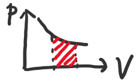
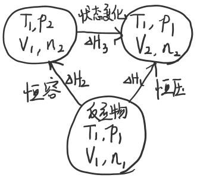

# 第2章 化学热力学基础

## 2.1 热力学第一定律

### 2.1.1 热力学的基本概念和常用术语

#### 体系与环境

* **体系**：研究的对象
* **环境**：体系以外的其他部分

体系与环境的交换关系

* **敞开体系**：有物质、能量交换
* **封闭体系**：无物质交换、有能量交换
* **孤立体系**：无物质、能量交换

#### 状态与状态函数

* **状态**：由一系列表征体系性质的物理量所确定下来的体系的存在形式
* **状态函数**：借以确定体系状态的物理量
  * **量度/广度性质**：具有加和性的状态函数
  * **强度性质**：不具有加和性的状态函数

#### 过程和途径

* **过程**：体系状态从始态到终态的变化
* **途径**：实现过程的基本方式

#### 体积功

* **体积功**：体系的体积变化时，体系克服外界压强所做的功，或外界对体系所做的功

$$W=-p_外\Delta V$$

#### 热力学能

* **热力学能/内能**$U$：体系内部一切能量的总和

  > 理想气体的$U$是$T$的函数

### 2.1.2 热力学第一定律

$$\Delta U=W+Q$$

> $W$：环境对体系做的功为正，体系对外做功为负
>
> $Q$：体系吸热为正，放热为负

注意：$W$和$Q$不是状态函数，而是与途径有关

## 2.2 热化学

### 2.2.1 化学反应的热效应

#### 恒容反应热$Q_V$

测量装置：弹式热量计

$$Q_V=\Delta U$$

#### 恒压反应热$Q_p$

测量装置：杯式热量计

> $Q_p=\Delta U-W=\Delta U+p_外\Delta V\\=U_2-U_1+p_外(V_2-V_1)\\=(U_2+p_2V_2)-(U_1+p_1V_1)$
>
> **焓**$H=U+pV$

$$Q_V=\Delta H$$

#### 反应进度$\xi$

$$\xi=\dfrac{\Delta n}{\nu}$$

> $\Delta n$：物质的量的变化
>
> $\nu$：化学计量数

#### $Q_V$与$Q_p$的关系

> 
>
> $Q_p=\Delta H_1=\Delta H_2+\Delta H_3\\=\Delta U_2+(p_2V_1-p_1V_1)+\Delta U_3+(p_1V_2-p_2V_1)\\=\Delta U_2+\Delta U_3+(p_1V_2-p_1V_1)\\=\Delta U_2+p_1(V_2-V_1)\\=Q_V+\Delta nRT$

$$Q_p=Q_V+\Delta nRT$$

> $\Delta n$：气体物质的量的改变量

$$\Delta_rH_m=\Delta_rU_m+\Delta \nu RT$$

### 2.2.2 盖斯定律

#### 热化学方程式

* 注明温度、压强（默认$101.3kPa, 298K$）
* 注明聚集状态
* 系数可以为分数

#### 盖斯定律

总反应热效应等于各步反应之和

### 2.2.3 生成热

**生成热**$\Delta_fH_m^\ominus$：某温度下，由标准状态各种元素的指定单质生成标准状态1mol纯物质的热效应

$$\Delta_rH_m^\ominus=\Sigma_i\nu_i\Delta_fH_m^\ominus（生成物）-\Sigma_i\nu_i\Delta_fH_m^\ominus（反应物）$$

### 2.2.4 燃烧热

**燃烧热**$\Delta_cH_m^\ominus$：100kPa下，1mol物质完全燃烧时的热效应

$$\Delta_rH_m^\ominus=\Sigma_i\nu_i\Delta_cH_m^\ominus（反应物）-\Sigma_i\nu_i\Delta_cH_m^\ominus（生成物）$$

### 2.2.5 从键能估算反应热

$$\Delta_rH_m^\ominus=\Sigma反应物断开的键能-\Sigma生成物形成的键能$$

## 2.3 化学反应的方向

### 2.3.1 过程进行的方式

**可逆途径**

* 体系经过无限多次变化达到新的状态
* 具有可逆性
* 此时体积功达到最大
* pV线无限接近pV=nRT的图线

### 2.3.2 化学反应进行的方向

各种物质均处于标准状态时，化学反应以不可逆方式进行的方向

### 2.3.3 熵

#### 熵的概念

$$S=k\ln{\Omega}$$

>$k=1.38\times10^{-23} J\cdot K^{-1}$：玻尔兹曼常数
>
>$\Omega$：微观状态数

熵是一种具有加和性的状态函数

#### 熵的求算

$$\Delta S=\dfrac{Q_r}{T}$$

> $Q_r$：以可逆方式完成这一过程时的热量

#### 标准熵

定义绝对零度的熵值为零

**标准熵**$S_m^\ominus$：从熵为零的状态出发，使体系变化到终态为p=100kPa和某温度T的熵变

$$\Delta_rS_m^\ominus=\Sigma_i\nu_iS_m^\ominus（生成物）-\Sigma_i\nu_iS_m^\ominus（反应物）$$

### 2.3.4 吉布斯自由能

$$G=H-TS$$

#### 吉布斯自由能判据

> 在恒温恒压下，$\Delta_rU=Q+W_体+W_非$
>
> 因此$Q=\Delta_rU-W_体-W_非\\=\Delta_rU-(-p\Delta V)-W_非=\Delta_r H-W_非$
>
> 可逆过程是吸热最多的过程，因此$Q_r\geq\Delta_rH-W_非$
>
> 而$Q_r=T\Delta S$
>
> 代入得$T\Delta S\geq\Delta H-W_非$
>
> 把$\Delta$符号打开，得$-[(H_2-T_2S_2)-(H_1-T_1S_1)]\geq-W_非$
>
> 考虑$G=H-TS$
>
> 得$-\Delta G\geq-W_非$

在不做非体积功情况下

* $\Delta G<0$：反应以不可逆方式进行
* $\Delta G=0$：反应以可逆方式进行
* $\Delta G>0$：反应不能进行

#### 标准摩尔生成吉布斯自由能

$$\Delta_rG_m^\ominus=\Sigma_i\nu_i\Delta_fG_m^\ominus（生成物）-\Sigma_i\nu_i\Delta_fG_m^\ominus（反应物）$$

$$\Delta_rG_m^\ominus=\Delta_rH_m^\ominus-T\Delta_rS_m^\ominus$$

| $\Delta_rH_m^\ominus$ | $\Delta_rS_m^\ominus$ |                    |
| --------------------- | --------------------- | ------------------ |
| －                    | ＋                    | 任何温度均可进行   |
| ＋                    | －                    | 任何温度均不可进行 |
| ＋                    | ＋                    | T较大时可进行      |
| －                    | －                    | T较小时可进行      |

