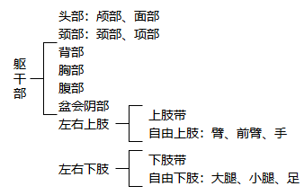
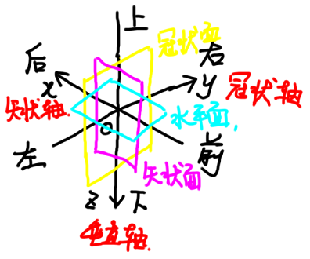

# 绪论

## 一、人体解剖学的定义与分科

>  **人体解剖学**是研究正常人体形态结构的科学。

* 巨视解剖学：系统解剖学、局部解剖学、外科解剖学、X线解剖学、断面解剖学、表面解剖学……
* 微视解剖学：组织学、细胞学、胚胎学

## 二、人体的分部与器官系统

* 10个局部

  

* 9个系统：运动、消化、呼吸、泌尿、生殖、脉管、感受器、神经、内分泌

## 三、解剖学姿势与术语

1. 解剖学姿势

>  **人体的标准解剖学姿势**：身体直立，面向前方，两眼平视正前方，两足并拢，足尖向前，双上肢下垂于躯干两侧，掌心向前。

2. 方位术语
   * 上/下：距颅顶/足底
   * 前/后：距腹侧/背侧面
   * 内侧/外侧：距正中矢状面
     * 上肢：尺侧/桡侧
     * 下肢：胫侧/腓侧
   * 内/外：空腔器官，距内腔
   * 浅/深：距皮肤表面
   * 近侧/远侧：四肢，距肢端
3. 轴：垂直轴(z)、矢状轴(x)、冠状轴(y)
4. 面：矢状面(xOz)、冠状面(yOz)、水平面(xOy)

## 四、变异与畸形

* **变异**：与正常形态不完全相同，但接近正常值，差异不显著
* **异常**：超出一般变异范围，出现概率极低，甚至影响正常生理功能