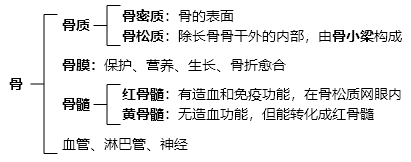
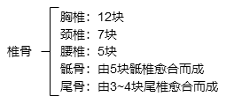

# 第1章 骨学

## 第1节 总论

### 1 骨的分类

* 按部位的分类：**中轴骨**（**颅骨**、**躯干骨**）、**四肢骨**

* 按形态的分类：**长骨**、**短骨**、**扁骨**、**不规则骨**（含气骨、籽骨等）

  > 长骨的一些结构
  >
  > * 骺：长骨的两端，有关节面，覆盖关节软骨
  > * 干骺端：骺和骨干相连部分，幼年保留**骺软骨**，成年后愈合成**骺线**
  > * 骨干：长骨中间的大部分，内部有髓腔

### 2 骨的表面形态

| 形态特点 | 术语                                                         |
| -------- | ------------------------------------------------------------ |
| 表面突起 | **突**：明显高起的骨面；**棘**：尖锐的小突起；隆起：基底较广的突起；**粗隆**/结节：表面粗糙的隆起； **嵴**：线形的高隆起；**线**：低而粗涩的嵴 |
| 骨面凹陷 | **窝**：大而浅的光滑凹面；**凹**/**小凹**：略小的窝；**沟**：长形的凹；**压迹**：浅凹陷 |
| 骨的空腔 | **腔**、**窦**、**房**：大的空腔；**小房**：小的空腔；**管**/**道**：长形通道；**口**/**孔**：腔或管的开口；**裂孔**：边缘不完整的孔 |
| 骨端膨大 | **头**/**小头**：圆形膨大；**颈**：头下略细部分；**髁**：椭圆形膨大；**上髁**：髁的突出处 |
| 其他特征 | **面**：平滑骨面；**缘**：骨的边缘；**切迹**：边缘的缺口或凹入 |

### 3 骨的构造

扁骨（如颅骨）的骨密质称为**内板**、**外板**，骨松质称为**板障**

### 4 骨的化学成分和物理性质

骨的化学成分会随年龄变化，有机质减少，无机质增多

* **有机质**：胶原纤维束+黏多糖蛋白，弹性和韧性
* **无机质**：碱性磷酸钙，坚硬和挺实

### 5 骨的发生和发育

骨发生于中胚层**间充质**。

* **膜化骨**：间充质膜状分布，逐渐骨化

  > 初始化骨形成的部位称为**骨化点**

* **软骨化骨**：间充质先发育为软骨，再继续骨化

  > 围绕软骨体中部产生的骨质称为**骨领**

## 第2节-1 躯干骨

躯干骨包括24块椎骨、1块骶骨、1块尾骨、1块胸骨、12对肋骨

### 1 椎骨

#### 一般形态

